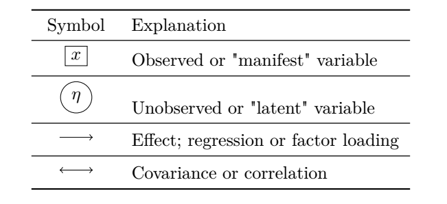

```{r setup, include=FALSE}
knitr::opts_chunk$set(echo = FALSE)
```

```{r script-hooks, echo=FALSE, message=FALSE, warning=FALSE, error=FALSE}
library(knitr)

# Script hook for printing only certain lines
hook_output <- knit_hooks$get("output")
knit_hooks$set(output = function(x, options) {
  lines <- options$output.lines
  if (is.null(lines)) {
    return(hook_output(x, options))  # pass to default hook
  }
  x <- unlist(strsplit(x, "\n"))
  more <- "..."
  if (length(lines)==1) {        # first n lines
    if (length(x) > lines) {
      # truncate the output, but add ....
      x <- c(head(x, lines), more)
    }
  } else {
    x <- c(if (abs(lines[1])>1) more else NULL, 
           x[lines], 
           if (length(x)>lines[abs(length(lines))]) more else NULL
    )
  }
  # paste these lines together
  x <- paste(c(x, ""), collapse = "\n")
  hook_output(x, options)
})

# From: https://community.rstudio.com/t/showing-only-the-first-few-lines-of-the-results-of-a-code-chunk/6963/2
# Retrieved on: 26.05.2020
```

```{r examples, echo=FALSE, message=FALSE, warning=FALSE, error=FALSE}
library(haven)
library(lavaan)

# Set working directory 
setwd("C:/Users/Henrik/github_projects/sem-methodentage-uni-giessen/data")

# Import ALLBUS 2018 
df <- read_sav("allbus2018.sav")

m4 <- '
xeno =~ 1*px06 + px07 + px10 + pa09 + pa19
anom =~ 1*lp03 + lp04 + lp05 + lp06
xeno ~~ anom 
'
m4.fit <- sem(m4,
              estimator = "ML", 
              data = df)
# summary(m4.fit, 
#         fit.measures = TRUE, 
#         # modindices = TRUE,
#         standardized = TRUE)
# modindices(m4.fit, sort = TRUE, minimum.value = 5)
```

# Struktur

<center>

{width=750px}

{width=750px}
</center>


# Einfürhung 

SEM umfasst verschiedene statistische Verfahren 

SEM ist ein **einheitliches Framework** für 

- lineare Regression
- Mediations- u. Pfadanalyse
- Konfirmatorische Faktorenanalyse 

und Kombinationen davon 

Viele weitere Extensions: Growth Curves, Fixed u. Random Effekte, Multiebeneanalyse, Gruppenvergleiche, usw. 

# Vorteile 

Die Hauptvorteile sind

- einfache Analyse von komplexen Mediationsprozesse (mehrere abhängige Variablen)
- latente Variablen und Messfehlerbereinigung 
- Modellfit-Maße um Übereinstimmung des Modells mit der empirischen Daten zu überprüfen
- Modifikationsindizes: lass die Daten sprechen

Herkömmliche Modelle wie lineare und logistische Regression, Faktorenanalyse, etc. sind in SEM möglich

SEM ist also **extrem flexibel**, bietet Lösungen für verschiedenen empirischen Fragen an

# Software 

Verschiedene Software mit Vor- und Nachteile

## Mplus 

Robusteste, zuverlässigste SEM Software


{width=500px}


- Vorteile 
  + robusteste SEM Software, breiteste Funktionalität 
  + einfache Syntax 
- Nachteile 
  + teuer
  + Input Dateien sind kniffig 
  + für Modellbildungsphase/experimentieren schlecht geeignet
  + nur für SEM (Rekodierung usw. nicht benutzerfreundlich) 

--- 

## Amos

Mit SPSS enthalten

{width=500px}


- Vorteile
  + intuitive UI (point-and-click)
- Nachteile 
  + wo sind die Gleichungen in Strukturgleichungsmodellen?
  + benutzerfreundlich aber Syntax ist meist effizienter 
  + SPSS ist teuer 
  
---  
  
## EQS

Ältere Software, ähnlich wie Mplus aber mit komplexere Syntax 

{width=600px}


- Vorteile 
  + komplexe Syntax hat didaktische Vorteile
- Nachteile 
  + etwas veraltet, dennoch immer noch unterstützt
  + teuer 
  + Input Dateien sind wie Mplus kniffig
  
--- 

## `lavaan`

Opensource kostenlose vollwertige SEM Software

{width=500px}


- Vorteile
  + vollwertig (bestimmt 90% der Funktionalität von Mplus) 
  + komplett kostenlos 
  + Integration in `R` Umgebung und `Rmarkdown`
  + Flexibilität, benutzerfreundlich 
- Nachteile
  + manche finden `R` grusilig 
  + nicht so robust/zuverlässig wie Mplus
  
# Literaturempfehlungen 

**Umfangreich:** 

Bollen, K. (1989). [Structural Equations with Latent Variables](https://onlinelibrary.wiley.com/doi/book/10.1002/9781118619179). New York, NY: John Wiley & Sons.

**Gut für den Einstieg:** 

Muthén, B.; Muthén, L.; Asparouhov, T. (2016). [Regression And Mediation Analysis Using Mplus](https://www.statmodel.com/Mplus_Book.shtml). Los Angeles, CA: Muthén & Muthén.

Kline, R. (2016). [Principles and Practice of Structural Equation Modeling. Fourth Edition](https://www.guilford.com/books/Principles-and-Practice-of-Structural-Equation-Modeling/Rex-Kline/9781462523344). New York, NY: The Guilford Press. 

Hoyle, R. (2015). [Handbook of Structural Equation Modeling](https://www.guilford.com/books/Handbook-of-Structural-Equation-Modeling/Rick-Hoyle/9781462516797/contents). New York, NY: The Guilford Press. 

**SEM in `lavaan`**

[The `lavaan` project](https://lavaan.ugent.be/) webpage. 

Rosseel, Y. (2012). [`lavaan`: An `R` Package for Structural Equation Modeling](https://www.jstatsoft.org/article/view/v048i02). Journal of Statistical Software, 48 (2). 

Steinmetz, H. (2015). [Lineare Strukturgleichungsmodelle: Eine Einführung mit `R`](https://openhsu.ub.hsu-hh.de/handle/10.24405/10451). München, Mering: Rainer Hampp Verlag.

**Spezielle Themen**

Urban, D.; Mayerl, J. (2014). [Strukturgleichungsmodellierung: Ein Ratgeber für die Praxis](https://www.springer.com/de/book/9783658019181). Wiesbaden: Springer VS.

Hoyle, R. (1995). [Structural Equation Modeling: Concepts, Issues, and Applications](Hoyle, R. (1995). Structural Equation Modeling: Concepts, Issues, and Applications). Thousand Oaks, CA: Sage Publications.


# Schritte 

Eine Analyse in SEM umfasst 4-6 Schritte

1. Spezifikation
2. Identifikation
3. Schätzung 
4. (Evaluation)
5. (Re-Spezifikation)
6. Interpretation 

Wobei Schritte 4-5 nur für **überidentifizierte** Modelle gelten (mehr dazu später)

Wir thematisieren die Schritte an den geeigneten Stellen, nicht unbedingt in der Reihenfolge 

Zunächst nur ein Überflug, im weiteren Verlauf mehr zu den einzelnen Punkten 

--- 

## Spezifikation  

Wir müssen jedes Modell erstmal spezifizieren. In SEM ist der Schritt aber ggf. umfangreicher

Beschäftigen uns mit den Fragen:

- welche Variablen?
- wie sind sie verteilt?
- in welchem Zusammenhang miteinander?
- was sind die Modellannahmen? 

Spezifikation soll **Theorie-geleitet** sein, angepasst an den vorhandenen Daten 

Verteilungen bestimmen Modell bzw. Schätzverfahren

Annahmen möglichst präzise formulieren, bei SEM bemerken, dass es mehrere abhängige Variablen (AV) geben kann

Wie gesagt, in SEM kann der Spezifikationsschritt **sehr umfangreich** sein:

```{r echo=TRUE}
m1 <- '
# Define latent variables xeno: xenophobia, anom: anomia 
  xeno =~ 1*px06 + l2*px07 + l3*px10 + l4*pa09 + l5*pa19
  anom =~ 1*lp03 + g2*lp04 + g3*lp05 + g4*lp06
# Mediation model 
  xeno ~ 1 + b1*anomia + b2*classupper + b3*female + b4*yearseduc + b5*east + b6*age 
  anom ~ 1 + t1*classupper + t2*female + t3*yearseduc + t4*east + t5*age 
# Exogenous correlations 
  clussupper ~~ female + yearseduc + east + age
  female ~~ yearseduc + east + age
  yearseduc ~~ east + age
  east ~~ age 
# Exogenous variances 
  classupper ~~ classupper
  female ~~ female
  yearseduc ~~ yearseduc
  east ~~ educ
  age ~~ age
# Disturbances or error variances 
  xeno ~~ xeno
  anom ~~ anom
# Constrain disturbance correlation to zero 
  xeno ~~ 0*anom
'
```

--- 

## Identifikation 

Ist **genug empirische Informationen** vorhanden sind, um das gewünschte Modell zu schätzen?

```{r echo=FALSE, warning=FALSE, message=FALSE, error=FALSE, output.lines=9:13}
summary(m4.fit)
```

Bei einer normalen Regression darf man nicht mehr unabhängige Variablen (UV) als Beobachtungen haben

Bei SEM komplizierter: 

- SEMs können komplizierte Modelle sein mit mehreren Mediatoren und latenten Variablen
- Es kann also mehr als nur einen Regressionkoeffizient pro UV geben
- SEM verwendet nicht die einzelnen Beobachtungen, sondern die beobachteten Mean Vector und Covariance Matrix 

Wir können nur **so viele Parameter schätzen wie wir empirische Datenpunkte haben** (im Form von Mittelwerte, (Ko)Varianzen)

--- 

## Schätzung 

Erst spezifizieren, dann sicherstellen, dass Modell identifiziert ist, dann muss es **geschätzt** werden

```{r eval=FALSE, echo=TRUE}
m1.fit <- sem(model = m1, 
              data = df, 
              estimator = "ML")
```

Schätzung betrifft die Regeln mit den die unbekannte Parameter gewählt werden 

Es gibt verschiedene Schätzer/Schätzverfahren: 

- Unweighted Least Squares
- Generalized Least Squares
- Maximum Likelihood
- Bayesian 

mit verschiedenen Vor- und Nachteilen

**Maximum Likelihood** (ML) ist die am weitesten verbreitete Schätzer

ML braucht die **Normalitätsannahme** in Bezug auf abhängige Variablen --- wenn die Annahme verletzt ist (sie ist in den empirischen Sozialwissenschaften oft verletzt) dann kann es unerwünschte Konsequenzen haben  

--- 

## Evaluation 

Das **Modellfit** sagt uns inwiefern das Modell zu den empirischen Daten passt  

Modellfit in SEM ist nicht nur $R^{2}$, sondern einen ganzheitlichen Test der Hypothese, dass das theoretische Modell den Data Generating Process (DGP) entspricht 

\begin{align}
\mathbf{\Sigma} & = \mathbf{\Sigma}(\hat{\mathbf{\theta}})
\end{align}

D.h., die Population-Kovarianzmatrix ($\mathbf{\Sigma}$) entspricht die sogenannte **Model-Implied** Kovarianzmatrix als Funktion der unbekannten Parameter $\mathbf{\theta}$

Daher ein starkes Tool der **Theorieprüfung** --- entspricht unsere Theorie der beobachteten Daten?

Evaluation des Modellfits nur für **überidentifizierte** Modelle (mehr empirische Daten als zu schätzende Parameter) anwendbar. D.h., wir müssen mindestens eine Restriktion ("Constraint") setzen, um die Hypothese zu überprüfen 

```{r echo=FALSE, warning=FALSE, message=FALSE, error=FALSE, output.lines=9:40}
summary(m4.fit, fit.measures=TRUE)
```

--- 

## Re-Spezifikation 

Modellfit gibt uns die Möglichkeit **Probleme mit unserer Theorie** aufzudecken

Passt das Modell suboptimal, sucht man die Ursache für das Misfit

In einem **explorativen Schritt** können wir die **Daten sprechen lassen**. D.h., wir testen explorativ die Modellrestriktionen und deren Plausibilität mit den sogenannten **Modifikationsindizes** (MI)

```{r echo=FALSE, warning=FALSE, message=FALSE, error=FALSE}
modindices(m4.fit, sort = TRUE, minimum.value = 5)
```

MI geben Auskunft darüber:

- Gibt es Parameter, die auf 0 gesetzt sind, die inkonsistent mit den Daten sind? Lösung: Restriktion aufheben um besseres Fit zu erzielen. 
- Gibt es Parameter, die nicht auf 0 gesetzt sind, die (fast) nicht zur Erklärung beitragen? Lösung: Restriktion setzen um ein sparsameres Modell hinzubekommen.  

**Achtung:** MI sind explorativ und völlig theoriefrei. Manche Modellanpassungen erscheinen plausibel, aber wenn sie so viel Sinn ergeben, **warum wurde das Modell nicht *a priori* so spezifiziert?** 

--- 

## Interpretation 

Je nach geschätzem Modell kann Interpretation was anderes bedeuten

- Bei einem linearen Regressionsmodell: **Stärke und Richtung** der geschätzten Effekte 
- Bei einer Konfirmatorischen Faktorenanalyse: die **psychometrischen Eigenschaften** (Validität, Reliabilität) des Messmodells 
- Beim generellen SEM gilt beides: Messmodelle müssen einwandfrei sein, um **Effekte zwischen latenten Konstrukten** interpretieren zu können 


# Linear Regression

Fangen wir mit einem **einfachen linearen Regressionsmodell** in SEM an 

So lernen wir die Logik in einem einfacheren Rahmen bevor wir komplexere Modelle behandeln 

Verwenden Bespiel von @Reinecke2010: 

- Effekt von Schicht und Anomia auf Fremdenfeindlichkeit/Xenophobie 
- Je höher die Schicht, desto weniger Anomie und Xenophobie 
- Je stärker anomische Gefühle (Unsicherheit, Orientierungslosigkeit), desto mehr Xenophobie 

<center>
{width=500px}

Von @Reinecke2010, 792, leicht angepasst
</center>

Wir ersetzen aber **Anomie mit Populismus** bzw. populistische Einstellungen, um die Daten im ALLBUS 2018 verwenden zu können 

--- 

## Linear Regression 

Das Modell dazu, das wir alle kennen würden wir schreiben

\begin{align}
\text{xeno} & = \beta_{0} + \beta_{1}\text{class} + \beta_{2}\text{populism} + \epsilon 
\end{align}

wo $\beta_{0}$ ist das Interzept, der Erwartungswert von Xenophobie wenn die UVs = 0. $\beta_{1}$ und $\beta_{2}$ sind die Koeffizienten die die UVs mit der AV verbinden. $\epsilon$ ist der Fehlerterm; all die unbeobachteten Faktoren, die Xenophobie beeinflussen. 

Wir gehen erstmal davon aus, dass alle Variablen **Mittelwertzentriert** sind. Das Interzept ist somit hinfällig

Wir können das Modell mit mittelwertzentrierten Variablen generisch so schreiben: 

\begin{align}
y & = \beta_{1}x_{1} + \beta_{2}x_{2} + \epsilon 
\end{align}

--- 

## Lineare Regression 

Die **Standardannahmen** sind: 

- *Linearität*: die Effekte der UVs sind konstant und additiv
- Keine perfekte *Multikollinearität*: die UVs sind nicht einfach gegenseitige lineare Kombinationen, d.h. u.a. $\Cor(x_{1},x_{2}) \ne 1$
- *"Zero conditional mean"* (manchmal: Exogeneität): die UVs sind "mean independent" und daher auch Unkorreliert mit dem Fehler, $\E(\epsilon | x_{1}, x_{2}) = \E(\epsilon) = 0$, auch $\Cor(\epsilon, \mathbf{x}) = \mathbf{0}$
- Keine *Autokorrelation*: der Fehler bei Person $i$ sagt uns nichts über den Fehler bei Person $j$, $\E(\epsilon_{i}\epsilon_{j}) = 0$, durch Zufallsstichprobe 
- *Homoskedastizität*: Konstante Varianz des Fehlers, $\Var(\epsilon | x_{1}, x_{2}) = \Var(\epsilon) = \sigma^{2}_{\epsilon}$
- *Normalverteilter Fehler*: der unerklärte Anteil der AV ist normalverteilt, $\epsilon \sim N(0, \sigma^{2}_{\epsilon})$ 

Wir fassen zusammen: 

\begin{align}
y | x_{1}, x_{2} & \sim N(\beta_{1}x_{1} + \beta_{2}x_{2}, \sigma^{2}_{\epsilon}) \\
\epsilon | x_{1}, x_{2} & \sim N(0, \sigma^{2}_{\epsilon})
\end{align}

--- 

## Pfaddiagramme 

In SEM verwenden wir genre **Pfaddiagramme**

Für das Modell hier ist es unnötig, aber wir sollten uns daran gewöhnen 

<center>


Pfaddiagram, multivariate Regression
</center>

Rechtecke sind für **beobachtete** Variablen, d.h., Spalten im Datensatz. Für **Effekte** benutzen wir gerichtete Pfeile, **Kovarianz/Korrelation** mit zweiköpfigen Pfeilen. Der **Fehlerterm** ist meistens nicht umrahmt, manchmal aber in einem Kreis.

Die folgende Tabelle fasst die Pfaddiagram Symbole zusammen: 

<center>


Pfaddiagram Symbole/Notation
</center>

**Frage**: Warum sollen $x_{1}$ und $x_{2}$ kovariieren? 

---

## Lineare Regression 

Das Modell ist **genau identifiziert** (just-identified) mit **null Freiheitsgraden** (df)

Die beobachtete Kovarianzmatrix ist

```{r}
cov(df[, c("px06", "id02", "pa30r")], use = "complete.obs")
```

Drei Varianzen und drei Kovarianzen 

**ABER**: Die Varianzen und Kovarianzen von den UVs wird auf die beobachteten Werte fixiert

Wir schreiben $\Var(x_{1}) = \phi_{11}$, $\Var(x_{2}) = \phi_{22}$ und $\Cov(x_{1},x_{2}) = \phi_{21}$ und 

$\hat{\phi}_{11} = 0.45$, $\hat{\phi}_{22} = 0.97$, $\hat{\phi}_{21} = -0.18$ (die beobachteten Werte)

D.h. übrig bleibt $\Var(y)$, $\Cov(y, x_{1})$ und $\Cov(y, x_{2})$: **drei empirische Informationen** 

Wir müssen **drei Parameter** schätzen, $\beta_{1}, \beta_{2}, \Var(\epsilon) = \psi_{11}$, ergibt $3 - 3 = 0$ df 

<center>

</center>

--- 

## Die Logik 

Wir schauen uns die Logik von SEM anhand des **denkbar einfachsten Regressionsmodells** an

\begin{align}
y & = \beta_{1}x + \epsilon
\end{align}

wo $x$ und $y$ mittelwertzentriert sind. 

In OLS geht es darum die **Summe der quadrierten Residuen** (SSR) zu minimieren, wobei die SSR ist eine Funktion der unbekannten Parameter, hier $\beta_{1}$

Wir wählen $\beta_{1}$ sodass die SSR zu klein wie möglich ist. 

\begin{align}
\sum_{i=1}^{n}\hat{\epsilon}_{i}^{2} & = \sum_{i=1}^{n}(y_{i} - \hat{\beta}x_{i})^{2} \\
\frac{\partial{\sum_{i=1}^{n}\hat{\epsilon}_{i}^{2}}}{\partial{\hat{\beta}_{1}}} & = -2\sum_{i=1}^{n}x_{i}(y_{i} - \hat{\beta}_{1}x_{i}) \\
0 & = \sum_{i=1}^{n}x_{i}y_{i} - \hat{\beta}_{1}\sum_{i=1}^{n}x_{i}^{2} \\
\hat{\beta}_{1}\sum_{i=1}^{n}x_{i}^{2} & = \sum_{i=1}^{n}x_{i}y_{i} \\
\hat{\beta}_{1} & = \frac{\sum_{i=1}^{n}x_{i}y_{i}}{\sum_{i=1}^{n}x_{i}^{2}}
\end{align}

Wir brauchen einen **flexibleren Rahmen** für SEM!

--- 

## Die Logik 

Es gibt eine **Populations-Kovarianzmatrix**

\begin{align}
\mathbf{\Sigma} & = \begin{bmatrix} \Var(y) & \Cov(y, x) \\ \Cov(x, y) & \Var(x) \end{bmatrix} 
\end{align}

Wir übersetzen unser Modell in die "Model-implied" Kovarianzmatrix, die eine Funktion der unbekannten Parameter ist. 

Basierend auf $y = \beta_{1}x + \epsilon$, haben wir

\begin{align}
\Var(y) & = \Var(\beta_{1}x + \epsilon) \\
 & = \beta_{1}^{2}\Var(x) + \Var(\epsilon)
\end{align}

\begin{align}
\Cov(y, x)  = \Cov(x, y) & = \Cov(x, (\beta_{1}x + \epsilon)) \\
 & =\beta_{1}\Var(x) 
\end{align}

weil $\E(x\epsilon) = 0$. 

\begin{align}
\Var(x) & = \Var(x)
\end{align}

**Achtung!**

Per Konvention: $\Var(x) = \phi$, $\Var(\epsilon) = \psi$

--- 

## Kovarianz Algebra 

Es gilt [@Bollen1989]:

\begin{align}
\Cov(x_{1}, x_{2}) & = \E[(x_{1} - \E(x_{1}))(x_{2} - \E(x_{2}))] \\
 & = \E(x_{1}x_{2}) - \E(x_{1})\E(x_{2}), \\
\end{align}

\begin{align}
\Var(x_{1}) & = \Cov(x_{1}, x_{1}) \\
 & = \E[(x_{1} - \E(x_{1}))^{2}] \\
 & = \E(x_{1}^{2}) - \E(x_{1})^{2}
\end{align}

Die "Sample analogs" sind:

\begin{align}
\cov(x_{1}, x_{2}) & = \frac{1}{n - 1}\sum_{i=1}^{n}(x_{1i} - \bar{x}_{1})(x_{2i} - \bar{x}_{2})
\end{align}

\begin{align}
\var(x_{1}) & = \frac{1}{n - 1}\sum_{i=1}^{n}(x_{1i} - \bar{x}_{1})^{2}
\end{align}

Wenn $c$ eine Konstante ist: 

\begin{align}
\Cov(c, x_{1}) & = 0\\
\Cov(c x_{1}, x_{2}) & = c\Cov(x_{1}, x_{2}) \\
\Var(c x_{1}) & = c^{2}\Var(x_{1}) \\
\Cov(x_{1} + x_{2}, x_{3}) & = \Cov(x_{1}, x_{3}) + \Cov(x_{2}, x_{3})
\end{align}

--- 

## Die Logik 

Die Model-implied Kovarianzmatrix ist 

\begin{align}
\mathbf{\Sigma}(\mathbf{\theta}) & = 
\begin{bmatrix} 
\beta_{1}^{2}\phi + \psi & \beta_{1}\phi \\
\beta_{1}\phi & \phi 
\end{bmatrix}
\end{align}

Wir nehmen an, unser Modell beschreibt die Population DGP

\begin{align}
\mathbf{\Sigma} & = \mathbf{\Sigma}(\mathbf{\theta}) \\
\begin{bmatrix}
 \Var(y) & \Cov(y, x) \\ \Cov(x, y) & \Var(x) 
\end{bmatrix} & = 
\begin{bmatrix} 
\beta_{1}^{2}\phi + \psi & \beta_{1}\phi \\
\beta_{1}\phi & \phi 
\end{bmatrix}
\end{align}

Wir beobachten die Population aber nicht, nur eine Stichprobe! Wir ersetzen $\mathbf{\Sigma}$ mit der Stichprobe Kovarianzmatrix $\mathbf{S}$

\begin{align}
\mathbf{S} & = \mathbf{\Sigma}(\mathbf{\theta}) \\ 
\begin{bmatrix} 
\var(y) & \cov(y, x) \\
\cov(x, y) & \var(y)
\end{bmatrix} & = 
\begin{bmatrix}
\beta_{1}^{2}\phi + \psi & \beta_{1}\phi \\
\beta_{1}\phi & \phi
\end{bmatrix} 
\end{align}

Wir möchten Werte für $\mathbf{\theta} = (\phi, \psi, \beta)$ finden. Schätzen heißt eine Regel anwenden, um die unbekannten Parameter zu finden. Das sind die **Schätzungen**

\begin{align}
\mathbf{S} & = \mathbf{\Sigma}(\mathbf{\hat{\theta}}) \\ 
\begin{bmatrix} 
\var(y) & \cov(y, x) \\
\cov(x, y) & \var(y)
\end{bmatrix} & = 
\begin{bmatrix}
\hat{\beta}_{1}^{2}\hat{\phi} + \hat{\psi} & \hat{\beta}_{1}\hat{\phi} \\
\hat{\beta}_{1}\hat{\phi} & \hat{\phi}
\end{bmatrix} 
\end{align}

Wir definieren die **Residuenmatrix**

\begin{align}
\mathbf{R} & = \mathbf{S} - \mathbf{\Sigma}(\hat{\mathbf{\theta}}) \\
 & = \begin{bmatrix} 
\var(y) & \cov(y, x) \\
\cov(x, y) & \var(y)
\end{bmatrix} -  
\begin{bmatrix}
\hat{\beta}_{1}^{2}\hat{\phi} + \hat{\psi} & \hat{\beta}_{1}\hat{\phi} \\
\hat{\beta}_{1}\hat{\phi} & \hat{\phi}
\end{bmatrix} 
\end{align}

# Schätzung 

Wir suchen die Werte für $\mathbf{\theta}$ die die Diskrepanzen in $\mathbf{R}$ minimieren.

Es gibt verschiedene **Schätzer** in SEM. Für jeden Schätzer gibt es eine **Fitting Funktion**, die wir optimieren (meistens minimieren) möchten. 

Unweighted Least Squares (ULS) mit Fitting Funktion $F_{ULS}$:

\begin{align}
F_{ULS} & = \frac{1}{2}\tr[(\mathbf{S} - \mathbf{\Sigma}(\mathbf{\theta}))^{2}].
\end{align}

Weighted Least Squares (WLS), v.a. für Heteroskedastizität

\begin{align}
F_{WLS} & = (\mathbf{s} - \mathbf{\sigma}(\mathbf{\theta}))^{\intercal}\mathbf{W}^{\intercal}(\mathbf{s} - \mathbf{\sigma}(\mathbf{\theta}))
\end{align}

wobei $\mathbf{s}$ und $\mathbf{\sigma}(\mathbf{\theta})$ die nicht-redundanten Elemente aus den Sample und Model-implied Matrizen sind. $\mathbf{W}$ ist eine Gewichtungsmatrix 

Generalized Least Squares (GLS), v.a. für Autokorrelation 

\begin{align}
F_{GLS} & = \frac{1}{2}\tr[([\mathbf{S} - \mathbf{\Sigma}(\mathbf{\theta})]\mathbf{W}^{-1})^{2}]
\end{align}

Maximum Likelihood (ML), die am häufigsten verwendete Schätzer

\begin{align}
F_{ML} & = \log |\mathbf{\Sigma}(\mathbf{\theta})| + \tr[\mathbf{S}\mathbf{\Sigma}^{-1}(\mathbf{\theta})] - \log |\mathbf{S}| - (p + q)
\end{align}

wobei $\log()$ der natürlicher Logarithmus ist, $|\cdot|$ die Determinante und $p$ und $q$ jeweils die Anzahl der UV und AV ist

--- 

## Schätzung 

Für jede Fitting Funktion nehmen wir die **erste partielle Ableitung**, setzen diese Gleichung auf null und lösen 

D.h. wie verhält sich die Fitting Funktion wenn wir einen Parameter ändern und die anderen konstant halten?

Die erste partielle Ableitung gibt die Berührungslinie ("Tangent Line"), d.h. die **Steigung** beim Parameterwert

Wenn die **Steigung null ist** ist das ein Optimum (minimum oder maximum) 

```{r echo=FALSE, fig.cap="Beispiel, Logik der Schätzung", fig.show="hold"}
set.seed(1234)

library(ggplot2)

n <- 1000

x <- rnorm(n = n, mean = 0, sd = 1)
y <- 5 * x + rnorm(n = n, mean = 0, sd = 1)

# Mean-center
x <- x - mean(x)
y <- y - mean(y)

dftemp <- data.frame(x, y)

# For reference
m1 <- lm(y ~ x)

ggplot(dftemp, aes(x = x, y = y)) + 
  geom_point() + 
  # geom_abline(intercept = 0, slope = -5, color = "red") +
  # geom_abline(intercept = 0, slope = -2.5, color = "blue") + 
  # geom_abline(intercept = 0, slope = 0, color = "green") + 
  # geom_abline(intercept = 0, slope = 2.5, color = "pink") + 
  geom_abline(intercept = coef(m1)[1], slope = coef(m1)[2], color = "purple", size = 1) + 
  annotate("text", x = 0, y = 15, label = "True DGP: y = 5 * x + e", color = "purple")

rss_func <- function(beta) {
  rss <- sum((y - beta * x)^2)
  return(rss)
}

drss_func <- function(beta) {
  drss <- -2 * (sum(y * x) - beta * sum(x^2))
  return(drss)
}

rss_func <- Vectorize(rss_func)
drss_func <- Vectorize(drss_func)

true_beta <- coef(m1)[2]; attr(true_beta, "names") <- NULL

int_func <- function(beta) {
  int <- -(drss_func(beta)) * beta + rss_func(beta)
  return(int)
}

int_func <- Vectorize(int_func)

inputs <- seq(from = -10, to = 10, by = 0.5)

df <- data.frame(beta = inputs, 
                 rss = rss_func(inputs),
                 slope = drss_func(inputs),
                 int = int_func(inputs))

ggplot(df, aes(x = beta, y = rss)) + 
  geom_point() + 
  geom_abline(intercept = int_func(-5), slope = drss_func(-5), color = "red") + 
  geom_abline(intercept = int_func(-2.5), slope = drss_func(-2.5), color = "blue") + 
  geom_abline(intercept = int_func(0), slope = drss_func(0), color = "green") +
  geom_abline(intercept = int_func(2.5), slope = drss_func(2.5), color = "pink") + 
  geom_abline(intercept = int_func(5), slope = drss_func(5), color = "purple", size = 1) + 
  scale_y_continuous(name = "Fitting Funktion Wert") + 
  scale_x_continuous(name = "Parameterwert")
```

--- 

## Schätzung

Ein **numerisches Beispiel** mit ML

Wir bleiben beim einfachen Modell, $y = \beta_{1}x + \epsilon$ und nehmen wir an folgende Kovarianzmatrix beobachtet zu haben 

\begin{align}
\mathbf{S} & = 
\begin{bmatrix}
11.88 & 6.13 \\
6.13 & 4.05
\end{bmatrix}
\end{align}

wobei $\var(y) = 11.88$, $\cov(x,y) = \cov(y,x) = 6.13$, $\var(x) = 4.05$

Die Varianz von der UV, $x$, wird nicht 'geschätzt' sondern wir nehmen einfach den beobachteten Wert, $\hat{\phi} = 4.05$

Für $F_{ML}$ haben wir

\begin{align}
F_{ML} & = \log\bigg| \begin{bmatrix} \beta^{2}\phi + \psi & \beta \phi \\ \beta \phi & \phi\end{bmatrix}\bigg| + \text{tr}\bigg[\begin{bmatrix} 11.88 & 6.13 \\ 6.13 & 4.05 \end{bmatrix} \begin{bmatrix} \beta^{2}\phi + \psi & \beta \phi \\ \beta \phi & \phi\end{bmatrix}^{-1}\bigg] - \log \bigg| \begin{bmatrix} 11.88 & 6.13 \\ 6.13 & 4.05 \end{bmatrix}\bigg| - (2) \\
 & = \log(\phi \psi) + \frac{11.88}{\psi} + \frac{4.05\beta^{2}}{\psi} + \frac{4.05}{\phi} - 2\frac{6.13\beta}{\psi} - 10.54 - 2
\end{align}

und wir nehmen die erste partielle Abeleitung jeweils für $\hat{\beta}$ und $\hat{\psi}$ und lösen

\begin{align}
\frac{\partial{F_{ML}}}{\partial{\beta}} & = \frac{8.1 \beta}{\psi} - \frac{12.26}{\psi} \\
0 & = \frac{8.1 \beta}{\psi} - \frac{12.26}{\psi} \\
\hat{\beta}_{ML} & = \frac{12.26}{8.1} = `r round(12.26 / 8.1, 2)` 
\end{align}

\begin{align}
\frac{\partial{F_{ML}}}{\partial{\psi}} & = \frac{12.26 \beta}{\psi^{2}} + \frac{1}{\psi} - \frac{4.05 \beta^{2}}{\psi^{2}} - \frac{11.88}{\psi^{2}} \\
0 & = \frac{12.26 (1.51)}{\psi^{2}}\psi^{2} + \frac{1}{\psi}\psi^{2} - \frac{4.05 (1.51)^{2}}{\psi^{2}}\psi^{2} - \frac{11.88}{\psi^{2}}\psi^{2} \\
\hat{\psi}_{ML} & = 2.65 
\end{align}

--- 

## Schätzung 

Manchmal v.a. bei komplexeren Modellen gibt es keine explizite Lösungen 

Deswegen **iteratives Verfahren**, um die Parameterschätzungen zu generieren 

D.h. wir fügen Werte in die Fitting Funktion so lange ein bis wir keinen besseren Fit erzielen 

Etwas genauer gesagt:

1. Suche einen **Startwert** aus (welcher ist oft egal).
2. Nehme die erste partielle Ableitung der Gleichung.
3. Ist die Steigung positiv? Startwert zu hoch. Positiv? Startwert zu gering. 
4. Suche einen neuen Wert (höher/niedriger als Startwert).
5. Wiederhole 2-4 jeweils mit neuem Wert bis die Steigung "kippt" (von positiv auf negativ und vice versa)

--- 

## Normalität

Wir verwenden ML als Schätzer in diesem Kurs

ML braucht die Annahme der (multivariate) Normalität, da die Likelihoods sonst nicht gebildet werden können 

D.h. wenn die bedingte Verteilung der AV (gegeben die UVs) normal ist, kann die Likelihood formuliert werden

```{r, echo=FALSE, fig.cap="Normal distribution assumption", out.width="50%", fig.ncol = 2, fig.show="hold", fig.align="center"}
n <- 10000

x <- rnorm(n, 0, 1)
hist(x, breaks = 30)

u <- rnbinom(n, 10, 0.5)
hist(u, breaks = 30)

w <- round(x)
hist(w)

d <- sample(0:1, size = n, replace = TRUE, prob = c(0.3, 0.7))
hist(d)
```

# Empirisches Beispiel 

Für die Beispiele während der Vorträge verwenden wir **ALLBUS 2018**: `allbus2018.sav`

Daten zu **Xenophobie/Fremdenfeindlichkeit**, **populistische Einstellungen** und **soziale Schicht**

- soziale Schicht: subjektive Schichteinstufung (`id02`)
- Populismus: "Politiker reden zu viel, handeln zu wenig [rekodiert]" (`pa30r`)
- Fremdenfeindlichkeit: "BRD ist gefährlich überfremdet" (`px06`)
 
`pa30` wurde rekodiert, sodass höhere Werte mehr Zustimmung bedeuten 

```{r echo=TRUE}
# Paket haven für SPSS Dateien
library(haven)

# Arbeitsverzeichnis 
setwd("C:/Users/Henrik/github_projects/sem-methodentage-uni-giessen/data") # Anpassen!

# Daten importieren  
df <- read_sav("allbus2018.sav")
```

--- 

## Empirisches Beispiel 

Daten sichten

```{r echo=TRUE}
# Daten sichten
head(df$id02); hist(df$id02)
head(df$pa30r); hist(df$pa30r)
head(df$px06); hist(df$px06)
```

**Frage:** Normalverteilt? 

Die **empirische Kovarianzmatrix** 

```{r echo=TRUE}
cov(df[, c("px06", "id02", "pa30r")], use = "complete.obs")
```

--- 

## Empirisches Beispiel 

Das Paket `lavaan` muss **nur einmal installiert werden** aber bei jeder neuen `R` Session neu geladen werden 

```{r echo=TRUE, eval=FALSE}
install.packages("lavaan") 
library(lavaan)
```

Wir **spezifizieren** das Modell in dem wir ein **Objekt** mit der Modellsyntax als String (Zeichenkette) erstellen

```{r echo=TRUE}
rm1 <- '
# Regression 
  px06 ~ beta1*id02 + beta2*pa30r
'
```

Wir benutzen den 'Regression' Operator `~`:  `px06` wird 'regressiert' auf `id02` und `pa30r`

Optional können wir 'Labels' benutzen, e.g., `beta1*` um die Parameter einen Namen zu geben 

In einem zweiten Schritt **schätzen** wir das model mit `sem()`

Dazu verweisen wir auf das Modell Objekt, `model = `, wo die Daten sind, `data = ` und (optional) welchen Schätzer wir wollen `estimator = `

```{r echo=TRUE}
rm1.fit <- sem(model = rm1, data = df, estimator = "ML")
```

---

## Empirisches Beispiel 

Zusammenfassung anfordern mit `summary()`

```{r echo=TRUE}
summary(rm1.fit)
```

Wir betrachten das Output im Einzelnen

--- 

## Empirisches Beispiel

Zunächst einige Eckdaten 

```{r output.lines=1:8}
summary(rm1.fit)
```

Die Parameter wurden nach 13 Iterationen gefunden (Konvergenz)

Der Schätzer ist ML

Optimizer ist eine Newton-artige Methode  

Drei Parameter ($\beta_{1}, \beta_{2}, \psi$)

3169 Beobachtungen (3477 - 3169 Missing) --- Default ist Listwise Deletion 

---

## Empirisches Beispiel 

Modellfit kann nicht evaluiert werden --- 0 df! 

```{r output.lines=10:16}
summary(rm1.fit)
```

Bei genau-identifizerten Modellen gibt es immer eine **exakte Lösung**

D.h. es gibt Schätzwerte, die die beobachtete Kovarianzmatrix genau replizieren

\begin{align}
\mathbf{S} & - \mathbf{\Sigma}(\mathbf{\hat{\theta}}) \\
\begin{bmatrix} 
2.001 & & \\
-0.262 & 0.453 & \\
0.520 & -0.175 & 0.973
\end{bmatrix}
& - 
\begin{bmatrix}
\hat{\beta}_{1}^{2}\hat{\phi}_{11} + \hat{\beta}^{2}_{2}\hat{\phi}_{22} - 2\hat{\beta}_{1}\hat{\beta}_{2}\hat{\phi}_{21} + \hat{\psi} & & \\
\hat{\beta}_{1}\hat{\phi}_{11} - \hat{\beta}_{2}\hat{\phi}_{22} & \hat{\phi}_{11} & \\
\hat{\beta}_{2}\hat{\phi}_{22} - \hat{\beta}_{1}\hat{\phi}_{11} & \hat{\phi}_{21} & \hat{\phi}_{22}
\end{bmatrix} \\
\begin{bmatrix} 
2.001 & & \\
-0.262 & 0.453 & \\
0.520 & -0.175 & 0.973
\end{bmatrix}
& - 
\begin{bmatrix}
-0.398^{2}0.453 + 0.462^{2}0.973 + 2(-0.398 \cdot 0.462) \cdot -0.175 + 1.657 & & \\
-0.398(0.453) - 0.462(0.973) & 0.453 & \\
0.462(0.973) -0.398(0.453) & -0.175 & 0.973
\end{bmatrix} \\
\begin{bmatrix} 
2.001 & & \\
-0.262 & 0.453 & \\
0.520 & -0.175 & 0.973
\end{bmatrix}
& - 
\begin{bmatrix}
2.001 & & \\
-0.262 & 0.453 & \\
0.520 & -0.175 & 0.973
\end{bmatrix} = \mathbf{0}
\end{align}

```{r echo=TRUE}
# Beobachtete Kovarianzmatrix
lavInspect(rm1.fit, "observed")

# Model-implied Kovarianzmatrix
lavInspect(rm1.fit, "implied")
```

---

## Empirisches Beispiel

Zwei Regressionskoeffizienten

```{r output.lines=21:25}
summary(rm1.fit)
```

`Estimate`: Die unstandardisierten Regressionskoeffizienten

`Std. Err`: Standardfehler

`z-value`: z-Wert, ergibt sich aus `Estimate` / `Std.Err`

`P(>|z|)`: p-Wert, zwei-seitiger Test 

Achte auf die Labels, abgekürzt zu `bet1`, `bet2`

Erhöht sich subj. soziale Schicht um eine Einheit, verringert sich Fremdenfeindlichkeit um 0.398 Einheiten

Erhöht sich Populismus um eine Einheit, erhöht sich Fremdenfeindlichkeit um 0.462 Einheiten 

---

## Empirisches Beispiel

Zuletzt die Varianzen

```{r output.lines=27:29}
summary(rm1.fit)
```

Eine einzige AV, Rest der (Ko)Varianzen sind fixiert zu beobachteten Werten 

Achte auf das `.` vor der Schätzung, i.e., `.px06`: Das heißt die Varianz ist eine **Fehler Varianz**

Tabelle sonst wie bei Regressions aufgebaut, `Estimate, Std.Err, z-value, P(>|z|)`

--- 

## Empirisches Beispiel 

Weitere Informationen sind erhältlich. Bspw. $R^{2}$

```{r echo=TRUE}
lavInspect(rm1.fit, "r2")
```

17.2% der Varianz von Fremdenfeindlichkeit lässt sich mit Schicht und Populismus erklären 

Eine Tabelle aller Parameter, geeignet um Infos zu Extrahieren 

```{r echo=TRUE}
lavInspect(rm1.fit, "list")
```

```{r echo=TRUE}
paste0("Der Effekt von Schicht auf Fremdenfeindlichkeit beträgt ", 
      round(lavInspect(rm1.fit, "list")[1, 14], 3), 
      " mit einem Standardfehler von ", 
      round(lavInspect(rm1.fit, "list")[1, 15], 3), ".")
```

--- 

# Pfaddiagramme erstellen

Es gibt ein Paket `semPlot` mit dem wir Pfaddiagramme der Modelle erstellen können 

```{r echo=TRUE, warning=FALSE, message=FALSE}
# install.packages("semPlot")
library(semPlot)

# Pfaddiagramm von rm1.fit erstellen
semPaths(rm1.fit)
```

---

## Pfaddiagramme erstellen

Mit zusätzlichen Optionen kann das Diagramm individuell eingerichtet werde 

```{r echo=TRUE, warning=FALSE, message=FALSE}
semPaths(rm1.fit, 
         style = "lisrel",    # Fehlervarianz anzeigen, exogene Varianz nicht
         whatLabels = "est",  # Geschätzte Koeffizienten anzeigen
         rotation = 2,        # Von links nach rechts aufbauen
         sizeMan = 8,         # Größe der beobachteten Variablen
         edge.label.cex = 1)  # Größe der Koeffizienten-Labels
```

# Referenzen 