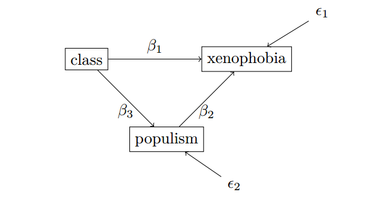
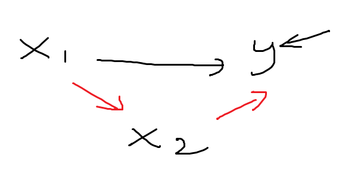
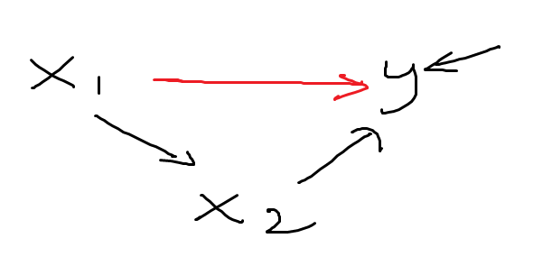
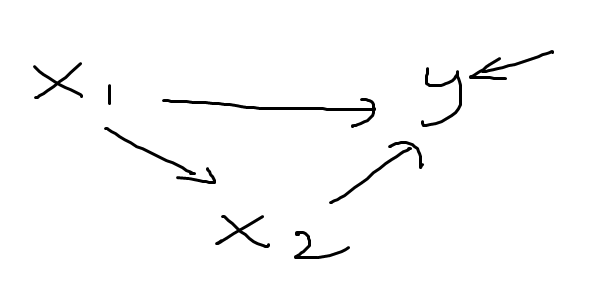
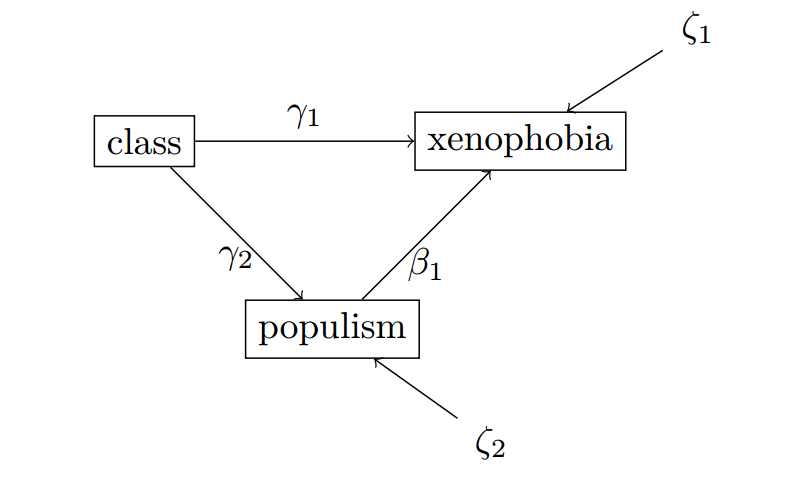
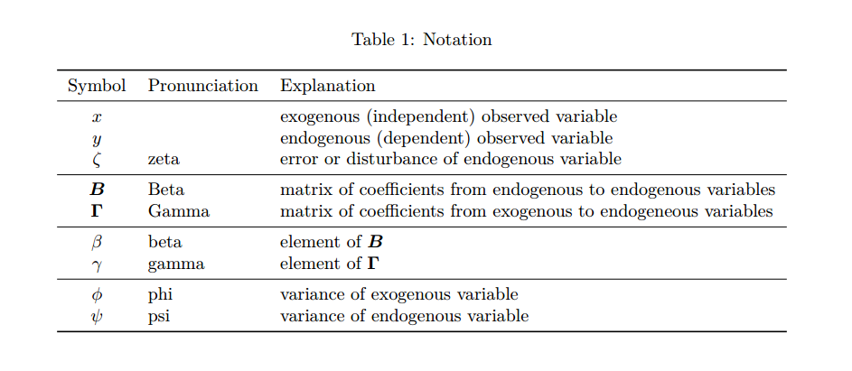
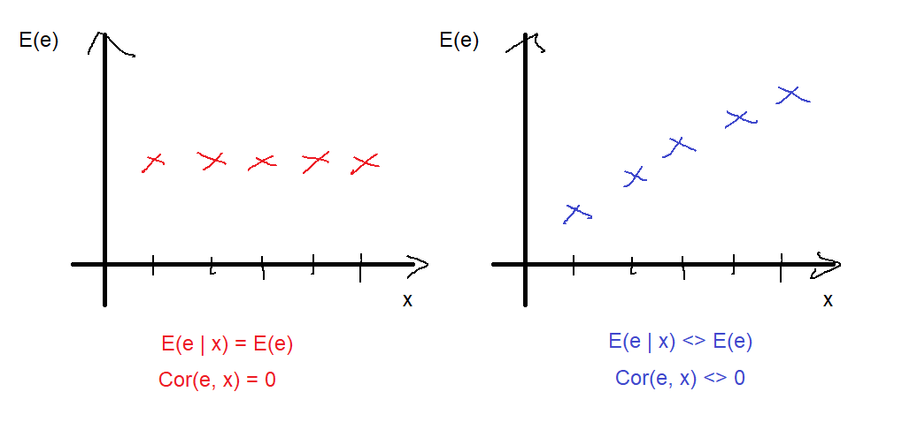

```{r setup, include=FALSE}
knitr::opts_chunk$set(echo = FALSE)
```

```{r script-hooks, echo=FALSE, message=FALSE, warning=FALSE, error=FALSE}
library(knitr)

# Script hook for printing only certain lines
hook_output <- knit_hooks$get("output")
knit_hooks$set(output = function(x, options) {
  lines <- options$output.lines
  if (is.null(lines)) {
    return(hook_output(x, options))  # pass to default hook
  }
  x <- unlist(strsplit(x, "\n"))
  more <- "..."
  if (length(lines)==1) {        # first n lines
    if (length(x) > lines) {
      # truncate the output, but add ....
      x <- c(head(x, lines), more)
    }
  } else {
    x <- c(if (abs(lines[1])>1) more else NULL, 
           x[lines], 
           if (length(x)>lines[abs(length(lines))]) more else NULL
    )
  }
  # paste these lines together
  x <- paste(c(x, ""), collapse = "\n")
  hook_output(x, options)
})

# From: https://community.rstudio.com/t/showing-only-the-first-few-lines-of-the-results-of-a-code-chunk/6963/2
# Retrieved on: 26.05.2020
```

```{r examples, echo=FALSE, message=FALSE, warning=FALSE, error=FALSE}
library(haven)
library(lavaan)

# Set working directory 
setwd("C:/Users/Henrik/github_projects/sem-methodentage-uni-giessen/data")

# Import ALLBUS 2018 
df <- read_sav("allbus2018.sav")

m4 <- '
xeno =~ 1*px06 + px07 + px10 + pa09 + pa19
anom =~ 1*lp03 + lp04 + lp05 + lp06
xeno ~~ anom 
'
m4.fit <- sem(m4,
              estimator = "ML", 
              data = df)
# summary(m4.fit, 
#         fit.measures = TRUE, 
#         # modindices = TRUE,
#         standardized = TRUE)
# modindices(m4.fit, sort = TRUE, minimum.value = 5)
```

# Struktur 

<center>

{width=750px}

{width=750px}
</center>

# Einführung

Letzte Sitzung: 

- **Schritte** für eine SEM-basierte Analyse (Spezifikation, Identifikation, Schätzung, Interpretation)
- **Logik** von SEM (Kovarianzbasiert, Fitting Funktionen)
- Analytische oder iterative **Optimierung**
- simple **Anwendung**: Lineare Regression 

Besonderheiten bei linearen Regression: 

- Null Freiheitsgraden, Modellevaluation und Re-Spezifikation mit MI unmöglich
- SEM wohl überflüssig 

# Mediation

Bei Mediation handelt es sich um **Mechanismen**

**Warum** führt Schicht zu Xenophobie? 

Eine Erklärung (in Anlehnung an @Reinecke2010): 

niedrige Schicht -> wenige Wertschätzung -> Enttäuschung -> Sehnsucht nach den guten alten Tagen -> Anomie -> Populismus (setzen sich für "Normalbürger" ein)

Anomie/Populismus -> Sündenbock -> Die "Anderen" sind schuld -> Xenophobie/Fremdenfeindlichkeit 

--- 

## Mediation 

Deshalb schlagen @Reinecke2010 eigentlich folgendes Modell vor:



Schicht führt zu Xenophobie/Fremdenfeindlichkeit über Populismus --- Populismus ist der angenommene Mechanismus

**Ungeklärte Frage**: Führt Schicht zu Fremdenfeindlichkeit über den Populismus-Mechanismus hinaus? Gibt es einen **direkten Effekt**?

--- 

## Mediation

Wir können das neue Modell schreiben: 

\begin{align}
\text{xeno} & = \beta_{1}\text{class} + \beta_{2}\text{populism} + \epsilon_{1} \\
\text{populismus} & = \beta_{3}\text{class} + \epsilon_{2}
\end{align}

Annahmen: 

- alle Variablen sind mittelwertzentriert
- keine Perfekte Multikollinearität
- Zufallsstichprobe (keine Autokorrelation)
- Homoskedastizität
- Normalverteilte Fehler

**Exogenität** betrifft jetzt beide Fehlertermen: $\E(\epsilon_{1} | \text{class}, \text{populism}) = 0$, $\E(\epsilon_{2} | \text{class}) = 0$. 

--- 

## Mediation

Wir sind daran interessiert:

- ob der Effekt von Schicht auf Fremdenfeindlichkeit ausschließlich über den Mechanismus Populismus läuft, oder 
- ob es einen eigenständigen Effekt von Schicht auf Fremdenfeindlichkeit über den Mediatorpfad hinaus gibt.


Der weg über den Mediator heißt der **indirekte Effekt**. Das ist der Produkt der beiden indirekten Pfaden, $\beta_{3} \cdot \beta_{2}$

Der direkte Weg heißt der **direkte Effekt**. Das ist $\beta_{1}$

Der **totale Effekt** ist die **Summe** aus den indirekten und direkten Pfade, $\beta_{1} + \beta_{3} \cdot \beta_{2}$

--- 

## Mediation

Wir unterscheiden zwischen:

- keinem Mediator: der indirekte Weg ist von der Stärke her sehr klein, oder Pfad ist nicht signifikant



---

## Mediation

- komplettem Mediator: indirekte Weg ist von der Stärke her interpretierbar und Pfad ist signifikant, direkter Weg ist nicht signifikant (bzw. zu klein)



---

## Mediation

- partiellem Mediator: sowohl direkter Weg als auch indirekte Wege sind signifikant (nicht zu klein)



---

## Mediation

Herkömmliche **formelle Schritte** bei Mediation:

1. Bivariate Assoziation zwischen $x_{1}$ und $y$ testen. Notiere Richtung, Stärke, Signifikanz
2. Bivariate Assoziation zwischen $x_{1}$ und $x_{2}$ testen. Notiere Richtung, Stärke, Signifikanz
3. Multivariate Assoziation, von $x_{1}, x_{2}$ und $y$ testen. Notiere Richtung, Stärke, Signifikanz
4. Vergleiche *direkten Effekt*, $x_{1} \rightarrow y$ unter Kontrolle von $x_{2}$ von (3) mit *totalem Effekt* $x_{1} \rightarrow y$ von (1)

Wenn direkter Effekt in (3) schwacher, nicht signifikant ist, ist $x_{2}$ der komplette Mediator

Wenn direkter Effekt immer noch signifikant ist, ist $x_{2}$ der partielle Mediator

In SEM machen wir Schritte 2-4 simultan! Test der Signifikanz vom indirekten Effekt auch automatisch

Bei komplexeren Modellen, z.B., $x \rightarrow w \rightarrow z \rightarrow y$, ist das vorteilhaft! 

--- 

## Mediation 

Wir machen Schritt 1 separat, um zu überprüfen, ob Mediatoranalyse sich überhaupt lohnt 

```{r echo=TRUE}
# Paket haven für SPSS Dateien
library(haven)
library(lavaan)

# Arbeitsverzeichnis 
setwd("C:/Users/Henrik/github_projects/sem-methodentage-uni-giessen/data") # Anpassen!

# Daten importieren  
df <- read_sav("allbus2018.sav")

# Bivariate
rm1 <- '
# Regression
  px06 ~ beta1*id02
'
rm1.fit <- sem(model = rm1, data = df, estimator = "ML")
```

(Wobei Schritt 1 irreführend sein kann: wenn direkte und indirekte Pfade gleich stark sind aber unterschiedlichen Vorzeichen, dann wird es keinen totalen Effekt geben!)

---

## Mediation 

Lasst uns zusammen auswerten! 

```{r echo=TRUE}
summary(rm1.fit)
```

--- 

# Kurzer Exkurs: Notation 

Im Mediationsmodell gibt es zwei abhängige Variablen

Aber Populismus ist sowohl UV als auch AV

Begriffe 'unabhängig' und 'abhängig' bringen in SEM nicht so viel

Wir verwenden lieber die Begriffe:

- **Exogen**: die Variable wird von **keiner anderen Variable im Modell erklärt** (keine Pfeile zeigen auf die Variable)
- **Endogen**: die Variable wird von **mindestens einer einen Variable im Modell erklärt** (mind. ein Pfeil zeigt auf die Variable)

Im Beispiel: Schicht ist exogen, sowohl Populismus als auch Fremdenfeindlichkeit ist endogen

--- 

## Kurzer Exkurs: Notation 

Wir schreiben das Modell als zwei Gleichungen:

\begin{align}
\text{xeno} & = \beta_{1}\text{class} + \beta_{2}\text{populism} + \epsilon_{1} \\
\text{populism} & = \beta_{3}\text{class} + \epsilon_{2}
\end{align}

Noch kompakter geht es mit Matrix Notation: 

\begin{align}
\begin{bmatrix} y_{1} \\ y_{2} \end{bmatrix} & = 
\begin{bmatrix} \beta_{1} & \beta_{2} \\ \beta_{3} & 0 \end{bmatrix} 
\begin{bmatrix} x_{1} \\ x_{2} \end{bmatrix} + 
\begin{bmatrix} \epsilon_{1} \\ \epsilon_{2} \end{bmatrix}
\end{align}

Oder nur

\begin{align}
\mathbf{y} & = \boldsymbol{\beta}\mathbf{x} + \boldsymbol{\epsilon}
\end{align}

---

## Kurzer Exkurs: Notation

Weiteres Problem: in $\mathbf{y} = \boldsymbol{\beta}\mathbf{x} + \boldsymbol{\epsilon}$ kommt die endogene Variable Populismus in $\mathbf{y}$ und in $\mathbf{x}$ vor

\begin{align}
\begin{bmatrix} y_{1} \\ y_{2} \end{bmatrix} & = 
\begin{bmatrix} \beta_{1} & \beta_{2} \\ \beta_{3} & 0 \end{bmatrix} 
\begin{bmatrix} x_{1} \\ x_{2} \end{bmatrix} + 
\begin{bmatrix} \epsilon_{1} \\ \epsilon_{2} \end{bmatrix} \\
\begin{bmatrix} \text{xeno} \\ \text{populism} \end{bmatrix} & = 
\begin{bmatrix} \beta_{1} & \beta_{2} \\ \beta_{3} & 0 \end{bmatrix} 
\begin{bmatrix} \text{class} \\ \text{populism} \end{bmatrix} + 
\begin{bmatrix} \epsilon_{1} \\ \epsilon_{2} \end{bmatrix}
\end{align}

Deshalb wird folgende Notation präferiert:

\begin{align}
\mathbf{y} & = \boldsymbol{B}\mathbf{y} + \boldsymbol{\Gamma}\mathbf{x} + \boldsymbol{\zeta} \\
\begin{bmatrix} \text{xeno} \\ \text{populism} \end{bmatrix} & = 
\begin{bmatrix} 0 & \beta_{1} \\ 0 & 0 \end{bmatrix}
\begin{bmatrix} \text{xeno} \\ \text{populism} \end{bmatrix} + 
\begin{bmatrix} \gamma_{1} \\ \gamma_{2} \end{bmatrix}
\begin{bmatrix} \text{class} \end{bmatrix} + 
\begin{bmatrix} \zeta_{1} \\ \zeta_{2} \end{bmatrix}
\end{align}

Damit: 

- können endogene Variablen weitere endogene Variablen beeinflussen
- wir unterscheiden zwischen Effekte von exogenen zu endogenen ($\gamma$) von Effekte von endogenen zu endogenen ($\beta$) 
- und wir heben $\epsilon$ für **Messfehler** auf 

--- 

## Kurzer Exkurs: Notation

Bemerke: 

\begin{align}
\mathbf{y} & = \boldsymbol{B}\mathbf{y} + \boldsymbol{\Gamma}\mathbf{x} + \boldsymbol{\zeta} \\
\begin{bmatrix} \text{xeno} \\ \text{populism} \end{bmatrix} & = 
\begin{bmatrix} 0 & \beta_{1} \\ 0 & 0 \end{bmatrix}
\begin{bmatrix} \text{xeno} \\ \text{populism} \end{bmatrix} + 
\begin{bmatrix} \gamma_{1} \\ \gamma_{2} \end{bmatrix}
\begin{bmatrix} \text{class} \end{bmatrix} + 
\begin{bmatrix} \zeta_{1} \\ \zeta_{2} \end{bmatrix}
\end{align}

ergibt 

\begin{align}
\text{xeno} & = 0 \cdot \text{xeno} + \beta_{1}\text{populism} + \gamma_{1}\text{class} + \zeta_{1} \\
 & = \beta_{1}\text{populism} + \gamma_{1}\text{class} + \zeta_{1} \\
\text{populism} & = 0 \cdot \text{xeno} + 0 \cdot \text{populism} + \gamma_{2}\text{class} + \zeta_{2} \\
 & = \gamma_{2}\text{class} + \zeta_{2}
\end{align}

Das Pfaddiagram: 

{width=500px}

---

## Kurzer Exkurs: Notation



---

# Mediation in `lavaan`

Normalerweise werden zwei Modelle geschätzt:

- bivariat, $x_{1} \rightarrow x_{2}$
- multivariat: $x_{1}, x_{2} \rightarrow y$

Wir basteln das Gesamtmodell zusammen im Nachhinein 

In SEM können wir Mediationsmodelle simultan schätzen

```{r echo=TRUE}
mm1 <- '
# Regressionen
  px06 ~ gamma1*id02 + gamma2*pa30r
  pa30r ~ beta1*id02
# Fehler Varianzen
  px06 ~~ psi1*px06
  pa30r ~~ psi2*pa30r
'
mm1.fit <- sem(model = mm1, data = df, estimator = "ML")
```

Wobei alles was wir brauchen ist eigentlich nur: 

```{r echo=TRUE, eval=FALSE}
mm1 <- '
  px06 ~ id02 + pa30r
  pa30r ~ id02
'
```

--- 

## Mediation in `lavaan`

Wie viele **Freiheitsgraden**? 

{width=500px}

```{r echo=TRUE}
cov(df[, c("px06", "id02", "pa30r")], use = "complete.obs")
```

--- 

## Mediation in `lavaan`

Modellzusammenfassung 

```{r echo=TRUE}
summary(mm1.fit)
```

---

## Mediation in `lavaan`

Was ist der **direkte Effekt**?

Was ist der **indirekte Effekt**?

Was ist der **totale Effekt**?

```{r output.lines=21:27}
summary(mm1.fit)
```

Ist Populismus ein **partieller** oder **kompletter Mediator**?  

---

# Signifikanztest des indirekten Effekts

Sie kennen vielleicht den **Sobel** Signifkanztest für indirekte Effekte.

Die t-Statistik (für dieses Beispiel) ist: 

\begin{align}
t & = \frac{\gamma_{2} \cdot \beta_{1}}{SE_{\gamma_{2} \cdot \beta_{1}}}
\end{align}

wobei 

\begin{align}
SE_{\gamma_{2} \cdot \beta_{1}} & = \sqrt{\gamma_{2}^{2} \cdot SE^{2}_{\beta_{1}} + \beta_{1}^{2} \cdot SE^{2}_{\gamma_{2}}}
\end{align}

--- 

## Signifikanztest des indirekten Effekts

Wir können `lavInspect()` um eine Tabelle der Parameter zu bekommen

```{r echo=TRUE}
lavInspect(mm1.fit, "list")
```

--- 

## Signifikanztest des indirekten Effekts

Damit können wir die benötigten Infos extrahieren 

\begin{align}
SE_{\gamma_{2} \cdot \beta_{1}} & = \sqrt{\gamma_{2}^{2} \cdot SE^{2}_{\beta_{1}} + \beta_{1}^{2} \cdot SE^{2}_{\gamma_{2}}}
\end{align}

\begin{align}
t & = \frac{\gamma_{2} \cdot \beta_{1}}{SE_{\gamma_{2} \cdot \beta_{1}}}
\end{align}

```{r echo=TRUE}
gamma2 <- lavInspect(mm1.fit, "list")[2, 14]
beta1 <- lavInspect(mm1.fit, "list")[3, 14]
se_gamma2 <- lavInspect(mm1.fit, "list")[2, 15]
se_beta1 <- lavInspect(mm1.fit, "list")[3, 15]

# SE indirekter Effekt
se_ind <- sqrt(gamma2^2 * se_beta1^2 + beta1^2 * se_gamma2^2)

# t-Statistik berechnen
t <- (gamma2 * beta1) / se_ind; t
```

Der Wert `r round(t, 3)` ist größer als die üblichen kritischen Werte (z.B. 1.96), also ist der indirekte Effekt insgesamt signifikant 

--- 

## Signifikanztest des indirekten Effekts

Alternativ können wir die gewünschten Effekte **definieren**

Wir verwenden dazu den `:=` Definition Operator zusammen mit Labels

```{r echo=TRUE}
mm1 <- '
# Regressionen
  px06 ~ gamma1*id02 + gamma2*pa30r
  pa30r ~ beta1*id02
# Fehler Varianzen
  px06 ~~ psi1*px06
  pa30r ~~ psi2*pa30r
# Effekte definieren
  dir := gamma1
  ind := gamma2*beta1
  tot := dir + ind
'
mm1.fit <- sem(model = mm1, data = df, estimator = "ML")
```

--- 

## Signifikanztest des indirekten Effekts

Passt das zum Sobel Test?

```{r echo=TRUE}
summary(mm1.fit)
```

--- 

# Mean structure 

Bisher alle Modelle mit **mittelwertzentrierten** Variablen 

`lavaan` zentriert alle Variablen per Default vor der Analyse, alle Interzepte sind daher null

Manchmal sind die Interzepte von Interesse, z.B. beim Gruppenvergleich 


--- 

## Mean structure 

Bisher war die **Exogenitätsannahme**

\begin{align}
\E(\epsilon | x) & = \E(\epsilon) = 0
\end{align}

Der erste Teil ist wichtiger: dass der Fehler Mittelwert unabhängig und daher auch **unkorreliert** ist mit den Prädiktor(en)

\begin{align}
\E(\epsilon | x) & = \E(\epsilon) \implies \Cor(x, \epsilon) = 0 
\end{align}



--- 

## Mean structure 

Der zweite Teil haben wir noch nicht besprochen:

\begin{align}
\E(\epsilon) & = 0
\end{align}

Wenn wir ein Interzept im Modell haben ist diese Annahme **ungefährlich**

\begin{align}
y & = \beta_{1}x + \epsilon \\
 & = \beta_{1}x + \epsilon + \E(\epsilon) - \E(\epsilon) \\
 & = \E(\epsilon) + \beta_{1}x + \epsilon - \E(\epsilon) \\
 & = \beta_{0}^{*} + \beta_{1}x + \epsilon^{*}
\end{align}

D.h., wir definieren $\beta_{0}^{*} = \E(\epsilon)$ und der Fehler ist nun Mittelwertzentriert, $\epsilon^{*} = \epsilon - \E(\epsilon)$ und $\E(\epsilon^{*}) = 0$

Das Interzept **absorbiert** den Erwartungswert des Fehlers 

Die Notation mit den Sternchen geben wir auf

---

## Mean structure

Wenn wir die Variablen alle Mittelwertzentrieren, dann ist das Interzept auch null. D.h., eine mittelwertzentrierte Variable hat einen Mittelwert von null:

\begin{align}
y & = \beta_{0} + \beta_{1}x + \epsilon \\
\E(y) & = \beta_{0} + \beta_{1}\E(x) + \E(\epsilon) \\
\beta_{0} & = \E(y) - \beta_{1}\E(x) - \E(\epsilon) \\
 & = 0 - \beta_{1} \cdot 0 - 0 \\
 & = 0
\end{align}

--- 

## Mean structure 

Das Interzept ist bekanntlich ein Koeffizient, der mit einer Konstante multipliziert wird, 

\begin{align}
y & = \beta_{0} \cdot 1 + \beta_{1}x + \epsilon
\end{align}

Gehen wir zurück zum empirischen Beispiel:

\begin{align}
y_{1} & = \beta_{1}y_{2} + \gamma_{1}x_{1} + \zeta_{1} \\
y_{2} & = \gamma_{2}x_{1} + \zeta_{2}
\end{align}

Wir fügen neue Koeffizienten ein, die jeweils mit der Konstante, 1.0, multipliziert werden. Wir nennen sie $\tau$:

\begin{align}
y_{1} & = \tau_{y1} + \beta_{1}y_{2} + \gamma_{1}x_{1} + \zeta_{1} \\
y_{2} & = \tau_{y2} + \gamma_{2}x_{1} + \zeta_{2}
\end{align}

**Achtung**: Was ist mit $x_{1}$?

---

## Meanstructure 

Wir fügen eine Konstante zu den Regressionsgleichungen hinzu

```{r echo=TRUE}
mm1 <- '
# Regressionen
  px06 ~ 1 + gamma1*id02 + gamma2*pa30r
  pa30r ~ 1 + beta1*id02
  id02 ~ 1 
# Fehler Varianzen
  px06 ~~ psi1*px06
  pa30r ~~ psi2*pa30r
# Effekte definieren
  dir := gamma1
  ind := gamma2*beta1
  tot := dir + ind
'
mm1.fit <- sem(model = mm1, data = df, estimator = "ML")
```

Jetzt ist $x_{1}$ **endogen**! Siehe `id02` unter `Variances:`

--- 

## Mean structure

Achte auf die **Freiheitsgraden**: warum immer noch 0? 

```{r echo=TRUE}
summary(mm1.fit)
```

---

## Mean structure

Es gibt sogar einen **Shortcut**: `meanstructure = TRUE`

```{r echo=TRUE}
mm1 <- '
# Regressionen
  px06 ~ gamma1*id02 + gamma2*pa30r
  pa30r ~ beta1*id02
# Fehler Varianzen
  px06 ~~ psi1*px06
  pa30r ~~ psi2*pa30r
# Effekte definieren
  dir := gamma1
  ind := gamma2*beta1
  tot := dir + ind
'
mm1.fit <- sem(model = mm1, data = df, estimator = "ML", 
               meanstructure = TRUE)
```

---

## Mean structure

```{r echo=TRUE}
summary(mm1.fit)
```

---

# Gruppenvergleiche

Lasst uns den Mean Structure mit einer Gruppenvergleich austesten.

Gruppenvergleich können wir 'händig' machen, indem wir zwei getrennte Datensätze generieren. 

Vielleicht interessieren wir uns für Geschlechterunterschiede

```{r echo=TRUE}
head(df$sex)
table(df$sex)
```

Neue Sub-Datensätze erstellen

```{r echo=TRUE}
dfm <- subset(df, df$sex == 1) # Männer
dff <- subset(df, df$sex == 2) # Frauen 
```

--- 

## Gruppenvergleiche

Gruppe: **Männer**

```{r echo=TRUE}
mm1m.fit <- sem(model = mm1, data = dfm, estimator = "ML", 
               meanstructure = TRUE)
```

Gruppe: **Frauen**

```{r echo=TRUE}
mm1f.fit <- sem(model = mm1, data = dff, estimator = "ML", 
               meanstructure = TRUE)
```

---

## Gruppenvergleiche

Gruppe: **Männer**

```{r echo=TRUE}
summary(mm1m.fit)
```

---

## Gruppenvergleiche

Gruppe: **Frauen**

```{r echo=TRUE}
summary(mm1f.fit)
```

--- 

## Gruppenvergleiche

Auch hier gibt es aber einen **Shortcut**: `group = `

Wir müssen aber die Labels aufheben!

```{r echo=TRUE}
mm1 <- '
# Regressionen
  px06 ~ id02 + pa30r
  pa30r ~ id02
# Fehler Varianzen
  px06 ~~ px06
  pa30r ~~ pa30r
'
```

(Muss `sex` als `numeric` definieren, warum auch immer.)

```{r echo=TRUE}
df$sex <- as.numeric(df$sex)
```

---

## Gruppenvergleiche

```{r echo=TRUE, eval=TRUE}
mm1sex.fit <- sem(model = mm1, data = df, estimator = "ML", 
                  meanstructure = TRUE, 
                  group = "sex")
summary(mm1sex.fit)
```

--- 

## Gruppenvergleiche

Teste die Hypothese, dass die Interzepte für Männer und Frauen gleich sind

- Modell wieder 'per Hand', d.h., ohne Shortcut spezifizieren 
- Labels pro Gruppe verwenden mit `c(labelgrupp1, labelgruppe2)`
- Setze Labels gleich -> **Equality Constraint**

Hier noch mit **unterschiedlichen Labels** pro Gruppe:

```{r echo=TRUE}
mm1 <- '
# Regressionen
  px06 ~ c(tau1m, tau1f)*1 + c(gamma1m, gamma1f)*id02 + c(gamma2m, gamma2f)*pa30r
  pa30r ~ c(tau2m, tau2f)*1 + c(beta1m, beta1f)*id02
# Fehler Varianzen
  px06 ~~ c(psi1m, psi1f)*px06
  pa30r ~~ c(psi2m, psi2f)*pa30r
'
mm1.fit <- sem(model = mm1, data = df, estimator = "ML", 
               meanstructure = TRUE, 
               group = "sex")
```

--- 

## Gruppenvergleiche

Jetzt mit **gleichen Interzept-Labels** für Männer und Frauen 

```{r echo=TRUE}
mm2 <- '
# Regressionen
  px06 ~ c(tau1, tau1)*1 + c(gamma1m, gamma1f)*id02 + c(gamma2m, gamma2f)*pa30r # <- Hier 
  pa30r ~ c(tau2m, tau2f)*1 + c(beta1m, beta1f)*id02
# Fehler Varianzen
  px06 ~~ c(psi1m, psi1f)*px06
  pa30r ~~ c(psi2m, psi2f)*pa30r
'
mm2.fit <- sem(model = mm2, data = df, estimator = "ML", 
               meanstructure = TRUE, 
               group = "sex")
```

---

## Gruppenvergleiche

Achte auf `Number of equality constraints`:

```{r echo=TRUE}
summary(mm2.fit)
```


# Referenzen 

