```{r setup, include=FALSE}
knitr::opts_chunk$set(echo = FALSE)
```

```{r script-hooks, echo=FALSE, message=FALSE, warning=FALSE, error=FALSE}
library(knitr)

# Script hook for printing only certain lines
hook_output <- knit_hooks$get("output")
knit_hooks$set(output = function(x, options) {
  lines <- options$output.lines
  if (is.null(lines)) {
    return(hook_output(x, options))  # pass to default hook
  }
  x <- unlist(strsplit(x, "\n"))
  more <- "..."
  if (length(lines)==1) {        # first n lines
    if (length(x) > lines) {
      # truncate the output, but add ....
      x <- c(head(x, lines), more)
    }
  } else {
    x <- c(if (abs(lines[1])>1) more else NULL, 
           x[lines], 
           if (length(x)>lines[abs(length(lines))]) more else NULL
    )
  }
  # paste these lines together
  x <- paste(c(x, ""), collapse = "\n")
  hook_output(x, options)
})

# From: https://community.rstudio.com/t/showing-only-the-first-few-lines-of-the-results-of-a-code-chunk/6963/2
# Retrieved on: 26.05.2020
```

```{r examples, echo=FALSE, message=FALSE, warning=FALSE, error=FALSE}
library(haven)
library(lavaan)

# Set working directory 
setwd("C:/Users/Henrik/github_projects/sem-methodentage-uni-giessen/data")

# Import ALLBUS 2018 
df <- read_sav("allbus2018.sav")

m4 <- '
xeno =~ 1*px06 + px07 + px10 + pa09 + pa19
anom =~ 1*lp03 + lp04 + lp05 + lp06
xeno ~~ anom 
'
m4.fit <- sem(m4,
              estimator = "ML", 
              data = df)
# summary(m4.fit, 
#         fit.measures = TRUE, 
#         # modindices = TRUE,
#         standardized = TRUE)
# modindices(m4.fit, sort = TRUE, minimum.value = 5)
```

# Struktur 

<center>

{width=750px}

{width=750px}
</center>

# Einführung

Letzte Sitzung: Mediationsmodelle, Mean Structure, Gruppenvergleiche 

- Bei Mediation geht es um **direkte** und **indirekte Effekte**
- Wollen die **Mechanismen** untersuchen
- Unterschied zw. **partieller** und **kompletter Mediator**
- Mean Structure: regressiere auf 1.0 oder `meanstructure = TRUE`
- Mehr Kontrolle per Hand, e.g., Labels setzen
- Gruppenvergleiche mit `group = "gruppierungsvariable"`
- Sogenannte **Gleichheitsrestiktionen** (Equality Constraints): Spezifische Gruppenunterschiede testen

# Konfirmatorische Faktorenanalyse

Wir interessieren uns in den Sozialwissenschaften für **abstrakte Konzepte**, z.B. 

- "Fremdenfeindlichkeit" / "Xenophobie"
- "Umwelteinstellungen"
- "Bedürfnis nach sozialer Anerkennung"

Solche Konzepte können nicht direkt gemessen werden

Andere dafür doch (relativ) direkt messbar: 

- Einkommen 
- Anzahl Kinder
- Luftverschmutzung

---

## Konfirmatorische Faktorenanalyse

Wir fassen abstrakte Konzepte als **latente Variablen**, auch genannt:

- Faktoren
- latente Konstrukte
- unbeobachtete Variablen
- hypothetische Konstukte / Variablen

Wir benutzen **konfirmatorische Faktorenanalyse** (Englisch: Confirmatory Factor Analysis, CFA), um latente Variablen zu Modellieren

Benutzen dafür die (Ko)Varianzen zwischen beobachteten Variablen, auch **Indikatoren** genannt

---

## Konfirmatorische Faktorenanalyse

Gehen davon aus, dass latente Variablen die **Ursache** für die beobachteten Werte der Indikatoren sind

Die Kovarianzen zwischen Indikatoren kann auf die **gemeinsame zugrunde liegende Ursache** zurückgeführt werden 

Wir zerlegen die beobachtete Varianz eines Indikators in 

- **gemeinsame Varianz** (von der latenten Variable verursacht)
- **"Unique" Varianz** (was nicht mit der latenten Variable zu tun hat)

# Faktorenanalyse 

**Explorative Faktorenanalyse** (EFA) ist außerhalb von SEM bekannt

Für eine Reihe Indikatoren, wie viele Faktoren brauchen wir, um die Kovarianzstruktur adequät zu beschreiben

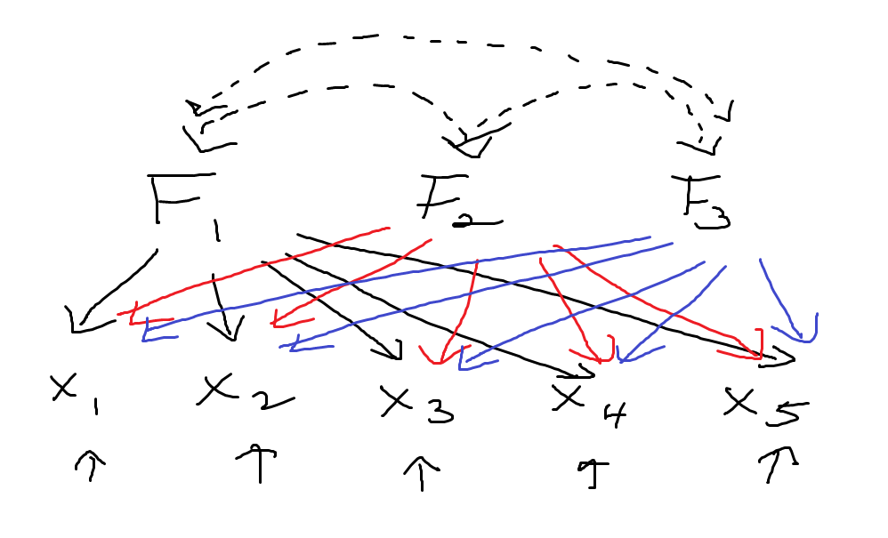

---

## Faktorenanalyse

Bei **Konfirmatorische Faktorenanalyse** legen wir die Anzahl der Faktoren sowie die Beziehungen zu den Indikatoren *a priori* fest. Daher 'konfirmatorisch'

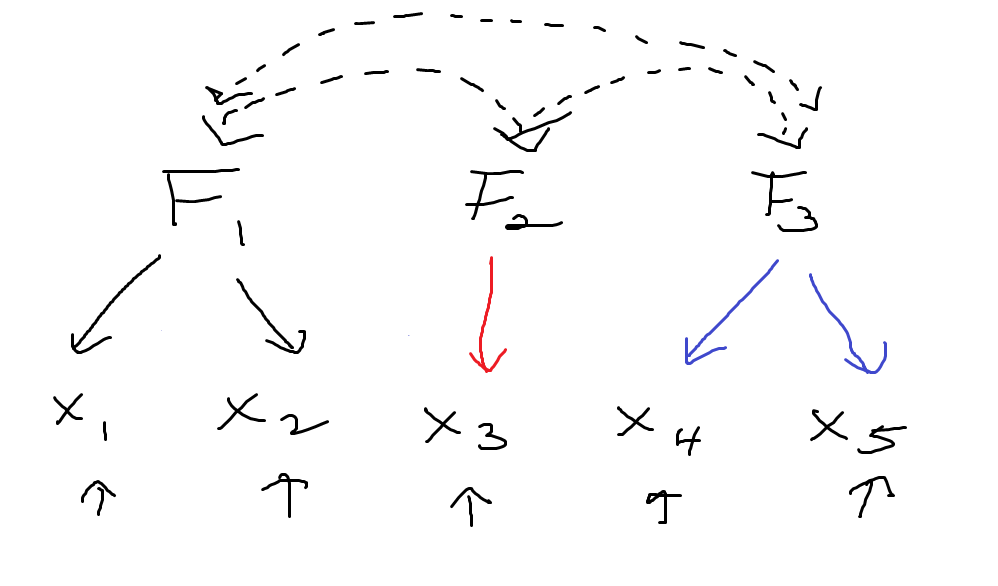

---

## Faktorenanylse

Bei einer CFA **zerlegen** wir beobachtete Varianz in 

- **gemeinsame Varianz**, verursacht durch die latente Variable
- einen **Fehlerterm**, der Anteil, der nichts mit der latenten Variable zu tun hat

Das baut sich auf **Classical Test Theory** auf: 

\begin{align}
\text{observed score} & = \text{true score} + \text{error}
\end{align}

Bzw.: 

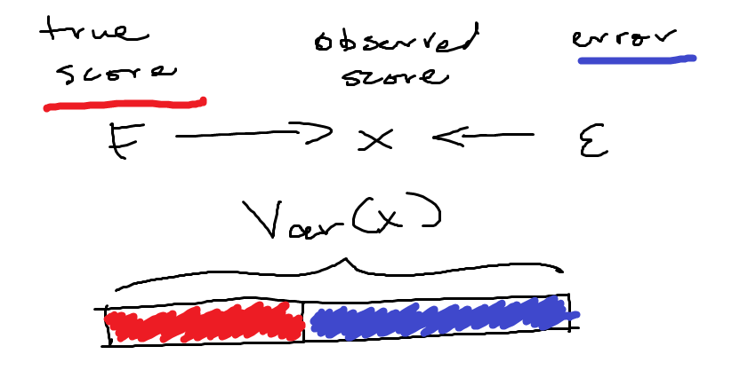

---

## Faktorenanalyse 

Formell: 

\begin{align}
x_{j} & = \lambda_{jk}\xi_{k} + \delta_{j}
\end{align}

(Änderung der Notation besprechen wir gleich.)

wobei $x_{j}$ der $j.$ Indikator ist, verbinden mit der $k.$ latenten Variable, $\xi_{k}$, über die Faktorladung $\lambda_{jk}$ (Subsrkipt $jk$: "$j$ regressiert auf $k$"), und wir nennen $\delta_{j}$ den **Messfehler** des $j.$ Indikators. 

Es heißt "Messfehler", weil wir normalerweise davon ausgehen, dass die **einzige Quelle systematischer Varianz** die latente Variable ist. Der **Rest sind zufälligen Fehler** wegen unpräzise Messungsinstrumente. 

Diese Ansicht ist wohl restriktiv, wir könnten auch sagen der Rest ist die Summe **unique Varianz** (von anderen Faktoren außer der $k.$ latenten Variable verursacht) und **Fehler Varianz**, die wirklich zufällig ist. 

Solange der Fehler unkorreliert mit der latenten Variable sowie andere Teile des Modells ist, ist die Unterscheidung nicht so wichtig. 

# Notation 

Wir führen weitere neue Notation ein

- Faktorladungen, $\lambda$, sind Regressionskoeffizienten, nur die **UV ist latent**
- $x$ wenn latente Variable exogen ist, und $y$ wenn latente Variable endogene ist
- exogene latente Variablen heißen $\xi$, endogene latente Variablen heißen $\eta$
- Messfehler von $x$ ist $\delta$, von $y$ ist $\epsilon$, mit Varianzen $\theta_{x}$, $\theta_{y}$
- sogenannte **Disturbance**, $\zeta$ ist der Fehlerterm einer endogenen latenten Variable 

--- 

## Notation 

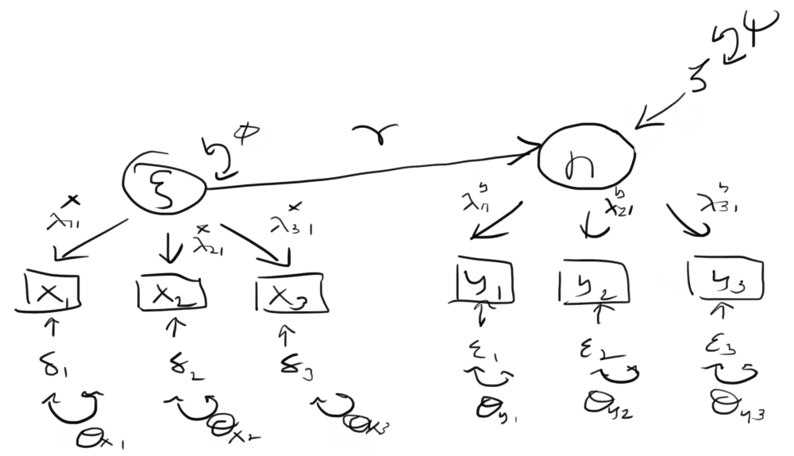

---

## Notation 

Die neue Notation ist in der Tablle zusammengefasst

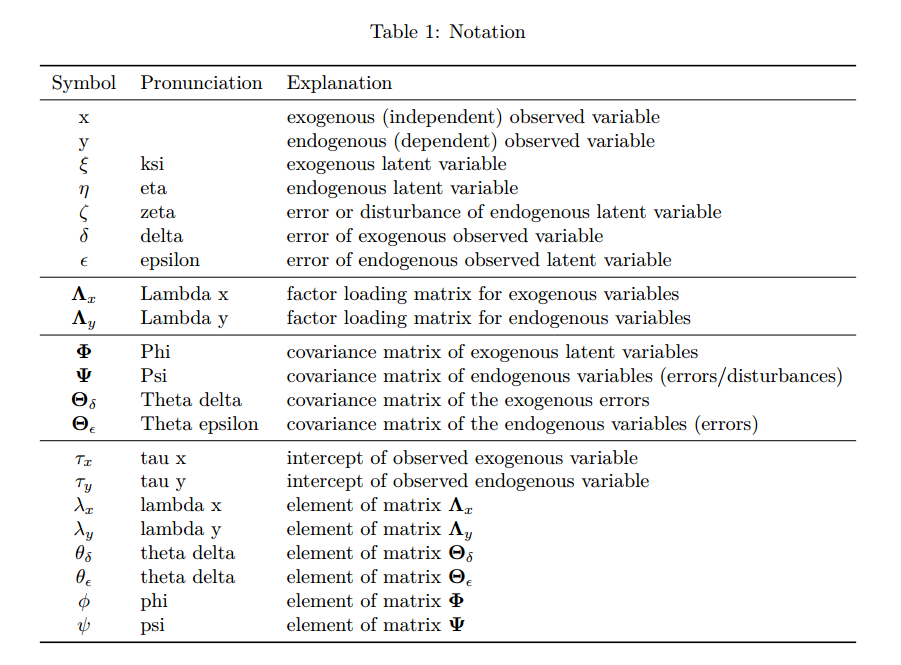

---

## Notation 

Betrachten wir zunächst eine einzige CFA (im Gegensatz zu Beispiel Abbildung) mit nur drei Indikatoren

Die latente Variable ist von nichts abhängig, also nennen wir die Indikatoren $x_{1}, x_{2}, x_{3}$. 

Die Latente Variable ist $\xi_{1}$ oder einfach $\xi$

Wir gehen von **mittelwertzentrierte Variablen** aus

\begin{align}
x_{1} & = \lambda_{11}\xi_{1} + \delta_{1} \\
x_{2} & = \lambda_{21}\xi_{1} + \delta_{2} \\
x_{3} & = \lambda_{31}\xi_{1} + \delta_{3}
\end{align}

oder noch kompakter

\begin{align}
\mathbf{x} & = \boldsymbol{\Lambda}_{x} \boldsymbol{\xi} + \boldsymbol{\delta} \\
\begin{bmatrix} x_{1} \\ x_{2} \\ x_{3} \end{bmatrix} & = 
\begin{bmatrix} \lambda_{11} \\ \lambda_{21} \\ \lambda_{31} \end{bmatrix} \xi_{1} + 
\begin{bmatrix} \delta_{1} \\ \delta_{2} \\ \delta_{3} \end{bmatrix}
\end{align}

Das nennen wir das **Messmodell**

---

## Notation 

Hier noch das Messmodell, wobei $\theta_{j}$, $\phi$ nicht dargestellt

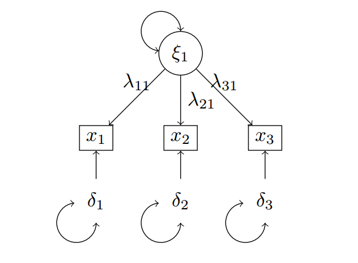

--- 

# Annahmen

Wir brauchen weitere Annahmen für Messmodelle. 

Es gilt weiterhin: 

- Linearität, d.h., $x_{j} = \lambda_{jk}\xi_{k} + \delta_{j}$
- keine Autokorrelation, d.h., $\E(\delta_{j_{i}},\delta_{j_{s}}) = 0, \ i \ne s$
- keine perfekte Multikollinearität, d.h., $\Cor(x_{j}, x_{m}) < 1, \ j \ne m$
- Homoskedastizität, d.h., $\Var(\delta_{j} | \xi_{1}) = \Var(\delta_{j}) = \theta_{\delta_{j}}$
- Normalverteilung, d.h., $\delta_{j} \sim N(0, \theta_{\delta_{j}})$

**Exogeneität** heißt jetzt aber: 

- $\E(\delta_{j} | \xi_{k}) = \E(\delta_{j}) = 0$: der Messfehler ist mit der latenten Variable unkorreliert
- $\E(\delta_{j}\delta_{m}) = 0, \ j \ne m$: der Messfehler von Indikator $j$ ist unkorreliert mit dem Messfehler von allen anderen Messfehlern


---

# Identifikation 

Bei den Regressionsmodellen mit beobachteten Variablen war Identifikation meist trivial 

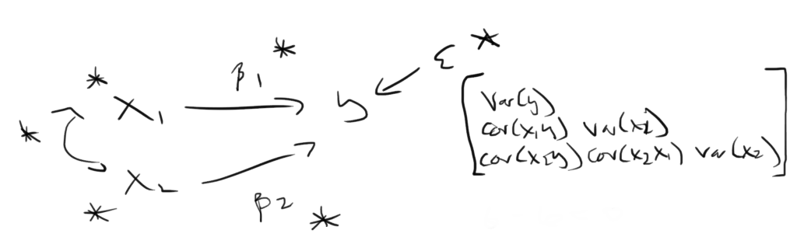

---

## Identifikation 

Bei einer CFA ist Identifikation nicht trivial 

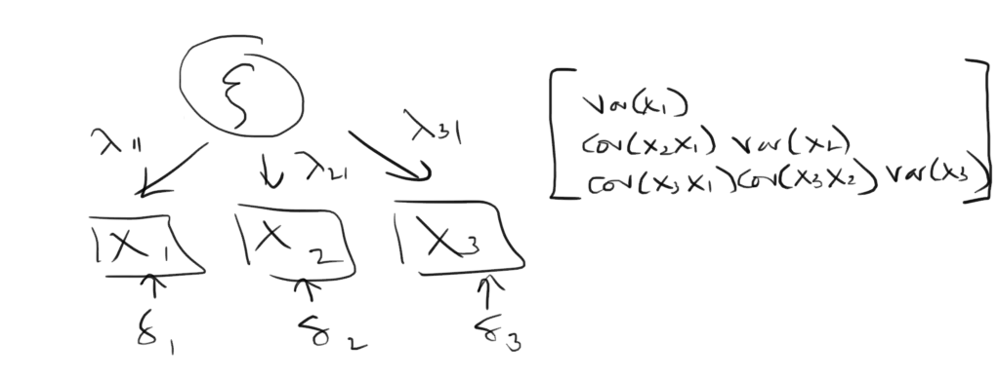

**Wie viele Freiheitsgrade?**

---

## Identifikation

Ein drei-Indikator Messmodell ist mit $-1$ df **nicht identifiziert** (bzw. nicht überidentifiziert)

Ein solches Modell kann so nicht geschätzt werden. Es wird zu einer Fehlermeldung führen (Std. Err. kann nicht geschätzt werden, usw.)

Wir müssen mindestens eine **Restriktion** (Constraint) aufsetzen

Wir **fixieren** entweder **eine Faktorladung auf 1.0**, oder wir lassen alle Faktorladungen frei schätzen, dafür fixieren wir **die Varianz der latenten Variable** auf 1.0

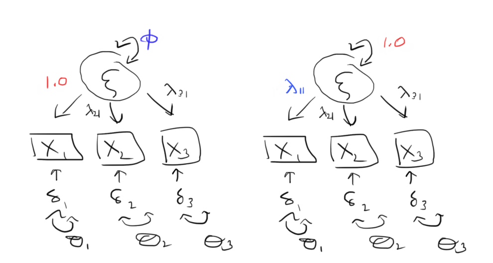

---

## Identifikation 

Wir verwenden diese Restriktionen, damit die latente Variable **eine Skala** hat.

Wenn wir eine Faktorladung auf 1.0 fixieren nennen wir das die **Marker Method**, die ist die gängigste Methode und Default in `lavaan`

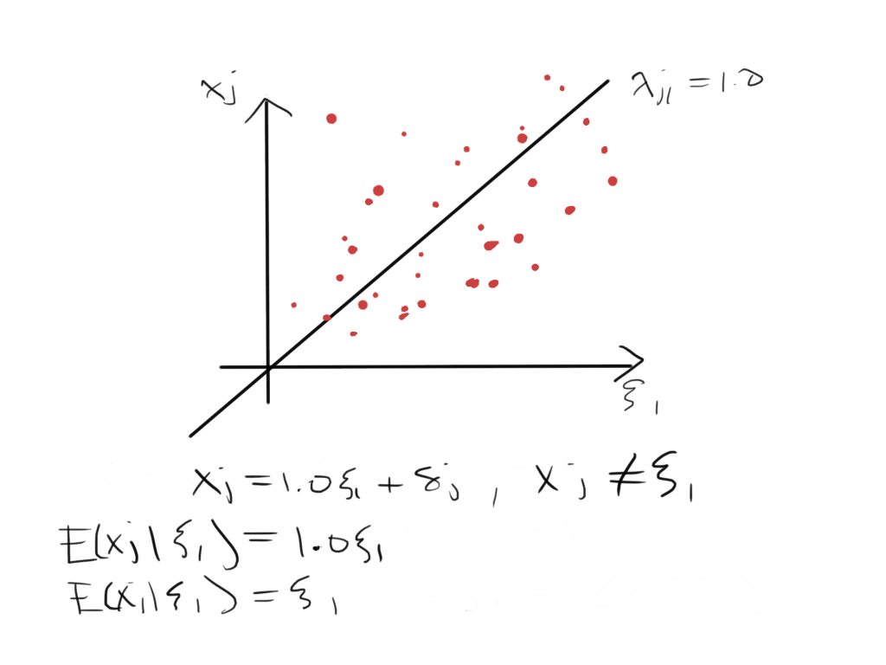

---

## Identifikation 

Indem wir entweder eine Faktorladung auf 1.0 fixieren oder die Varianz der latenten Variable auf 1.0 fixieren gewinnen wir 1 Freiheitsgrad 

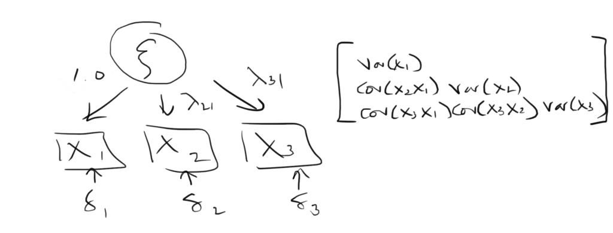

**Wie viele Freiheitsgrade jetzt?**

# Empirisches Beispiel 

Lasst uns ein empirisches Beispiel anschauen

Wir replizieren das Messmodell für Fremdenfeindlichkeit in @Reinecke2010

Die Items sind im ALLBUS 2018 verfügbar: 

- $x_{1}$: "ZUSTIMMUNG: BRD GEFAEHRLICH UEBERFREMDET" (`px06`)
- $x_{2}$: "ZUSTIMM.: AUSLAENDER LANDSLEUTE HEIRATEN" (`px07`)
- $x_{3}$: "ZUSTIMMUNG: ANSCHLAEGE ASYLBEWERBERHEIME" (`px10`)

jeweils mit 1: "stimme überhaupt nicht zu", ..., 5: "stimme voll und ganz zu". 

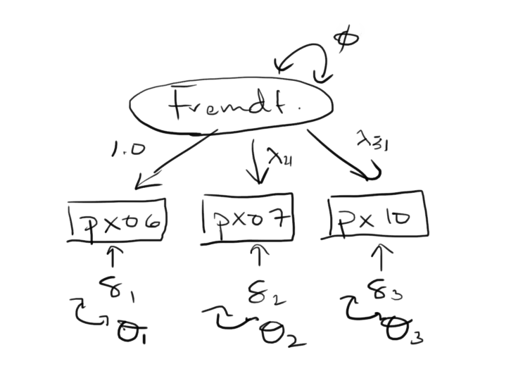

---

## Empirisches Beispiel 

Daten laden

```{r echo=TRUE}
# Paket haven für SPSS Dateien
library(haven)
library(lavaan)

# Arbeitsverzeichnis 
setwd("C:/Users/Henrik/github_projects/sem-methodentage-uni-giessen/data") # Anpassen!

# Daten importieren  
df <- read_sav("allbus2018.sav")
```

Warum die Korrelationsmatrix inspizieren? 

```{r echo=TRUE}
# Korrelationsmatrix inspizieren
cor(df[, c("px06", "px07", "px10")], use = "complete.obs")
```

---

## Empirisches Beispiel 

Wir benutzen den `=~` oder "measured by" Operator, um das Messmodell zu spezifizieren

D.h., wir erstellen eine latente Variable, die wir `xi1` nennen können (müssen nicht), die anhand drei Indikatoren gemessen wird

Wir verwenden den Marker Method und fixieren die Faktorladung für `px06` auf 1.0

```{r echo=TRUE}
cfa1 <- '
# Messmodell
  xi1 =~ 1*px06 + l2*px07 + l3*px10
# Fehlervarianzen
  px06 ~~ d1*px06
  px07 ~~ d2*px07
  px10 ~~ d3*px10
# Varianz der latenten Variable
  xi1 ~~ phi1*xi1
'
```

---

## Empirisches Beispiel 

Beachte, alles was wir brauchen ist eigentlich

```{r echo=TRUE, eval=FALSE}
cfa1 <- '
xi1 =~ px06 + px07 + px10
'
```

Per Default fixiert `lavaan` die erste Faktorladung auf 1.0

Es gibt ein spezielles "Wrapper" für CFA Modelle, `cfa()`. Wrappers unterscheiden sich nach den **Default Settings**. 

Momentan gibt es aber noch keine Unterschiede zwischen `sem()` und `cfa()`

```{r echo=TRUE}
cfa1.fit <- cfa(model = cfa1, data = df, estimator = "ML")
```

---

## Empirisches Beispiel

Die Faktorladungen sind v.a. von Interesse, unter `Latent Variables:`

```{r echo=TRUE}
summary(cfa1.fit)
```

**Interpretation der Faktorladungen?** 

---

# Kriterien

Mit CFA möchten wir den Zusammenhang zwischen den beobachteten Indikatoren und latenten Variablen untersuchen

Wie sehr ein Indikator von der latenten Variable abhängt sieht man anhand der **Faktorladungen**

Erhöht sich die latente Variable $k$ um eine Einheit, erhöht sich den Indikator $j$ um durchschnittlich $\lambda_{jk}$ Einheiten 

Formell betrachten wir die **Validität** und **Reliabilität** des Messmodells 

--- 

## Validität

Validität betrifft die Frage, ob **wir das gemessen haben was wir eigentlich messen wollten** 

Es gibt unterschiedliche Formen von Validität

- **Inhaltsvalidität**: eine qualitätive Einschätzung der wichtigsten **Eigenschaften** eines Konzepts (z.B., Sozioökonomischer Status umfasst Einkommen, Bildung und Beruf)
- **Kriteriumsvalidität**: ein zweites Konzept heranziehen, womit das erste Konzept korrelieren sollte (z.B., selbstberichtetes Einkommen sollte mit administrativen Daten übereinstimmen)
- **Konstruktvalidität**: können theoretische Zusammenhänge zwischen Konzept und Messungen empirisch bestätigt werden? (z.B., die Korrelationen zwischen Indikatoren von Fremdenfeindlichkeit sollten untereinander positive signifikante Korrelationen aufweisen)

--- 

## Validität

Inhaltsvalidität braucht ein Konsens darüber, was die wichtigen Eigenschaften eines Konzepts sind, was oft fehlt (selten sind Konstrukte so etabliert wie SES)

Es fehlt auch oft ein geeignetes Kriterium, um Kriteriumsvalidität zu überprüfen (bspw. fehlende administrative Daten)

Konstruktvalidität ist dafür relativ leicht zu überprüfen und es wird zwischen **Konvergent** und **Divergent** Konstruktvalidität (Englisch: Convergent, Divergent)

Im Sinne einer CFA heißt Kovergent Konstruktvalidität, dass die geeigneten Indikatoren auf die latente Variable tatäschlich "laden"

Divergent Konstruktvalidität heißt Indikatoren einer latenten Variable sollten nicht auch auf eine andere latente Variable laden

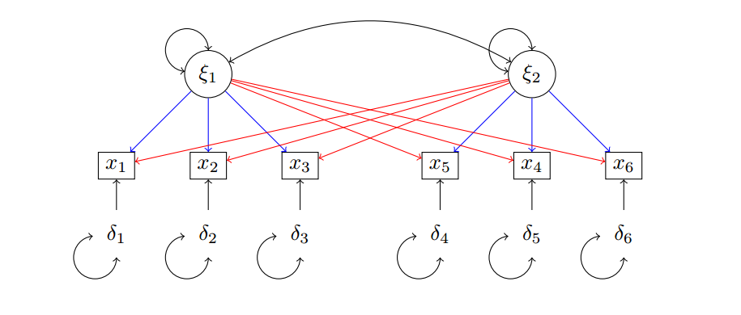

---

## Validität 

Formell bei konvergent Konstruktvalidität [@Bollen1989, p. 256]

- haben die Faktorladungen das richtige Vorzeichen? (z.B., aus der Literatur)
- sind die Faktorladungen "stark genug" bzw. so wie in vergangenen Studien schon beobachtet
- sind die Faktorladungen statistisch signifikant? 

Bei divergent Konstruktvalidität gilt genau das Gegenteil: am besten schwache, nicht signifikante Faktorladungen zu anderen latenten Variablen

---

## Validität 

Um die Stärke der Faktorladungen zu untersuchen möchten wir die **standardisierten Faktorladungen** anschauen

Dazu das Argument `standardized = TRUE` zum `summary()` Call hinzufügen

```{r echo=TRUE, output.lines=21:33}
summary(cfa1.fit, standardized = TRUE)
```

Die standardisierten Faktorladungen sind unter `Std. all` 

---

## Validität 

Was sind die standardisierten Faktorladungen? 

\begin{align}
x_{j} & = \lambda_{jk}\xi_{k} + \delta_{j} \\
\Var(x_{j}) & = \Var(\lambda_{jk}\xi_{k} + \delta_{j}) \\
 & = \lambda_{jk}^{2}\phi_{k} + \theta_{j}
\end{align}

wobei $\phi_{k} = \Var(\xi_{k})$, $\theta_{j} = \Var(\delta_{j})$ und $\Cov(\xi_{k}, \delta_{j}) = 0$

Wir wissen das eine standardisierte Variable eine Varianz von 1.0 hat und $x_{j}$ und $\xi_{k}$ sind standardisiert

\begin{align}
\Var(x_{j})^{*} & = \lambda_{jk}^{2*}\phi_{k}^{*} + \theta_{j}^{*} \\
1.0 & = \lambda_{jk}^{2*}(1.0) + \theta_{j}^{*} \\
1.0 - \theta_{j}^{*} &  =\lambda_{jk}^{2*}
\end{align}

D.h. die **quadrierte standardisierte Faktorladung** ist 1.0 minus die standardisierte Varianz des Fehlers 

---

## Validität 

Nehmen wir `px07` als Beispiel: die standardisierte Faktorladung ist 0.669

```{r echo=TRUE, output.lines=21:33}
summary(cfa1.fit, standardized = TRUE)
```

\begin{align}
\lambda_{21}^{2*} & = 1.0 - \theta_{2}^{*} \\
 & = 1.0 - 0.512  \\
\lambda_{21}^{*} & = \sqrt{1.0 - 0.512} \\
 & = 0.669
\end{align}

---

## Validität 

Von den letzten Folien sehen wir, dass die quadrierte standardisierte Faktorladung die **Varianzanteil ist, die auf die latente Variable zurückzuführen ist**

\begin{align}
\lambda_{jk}^{2*} & = 1.0 - \theta_{j}^{*}
\end{align}

Eine standardisierte Faktorladung von $0.7$ heißt $0.7^{2} = 0.49$ oder $49\%$ der Varianz ist systematische Varianz, vermutlich von der latenten Variable verursacht (siehe Notizen, hängt von den Annahmen ab)

Die standardisierte Faktorladung ist übrigens auch die **(partielle) Korrelation zwischen Indikator und latenten Variable** 

Daumenregel: ca. $50\%$ der Varianz des Indikators sollte auf die latente Variable zurückzuführen sein --- entspricht $\lambda_{jk}^{*} > 0.7$ (manche empfehlen ab $0.5$)

---

## Validität 

Test your knowledge!

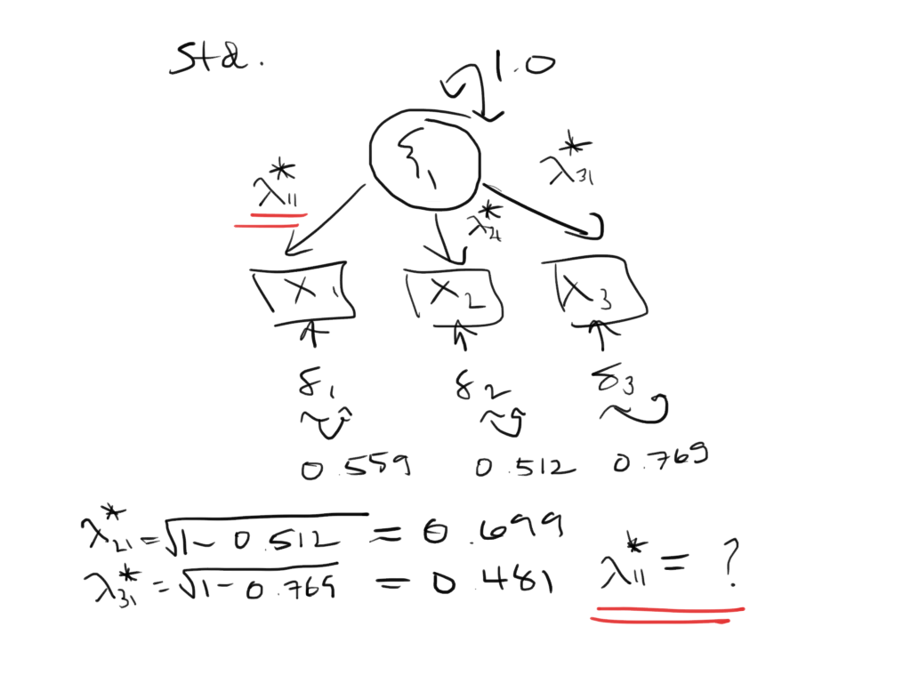


---

## Reliabilität

Reliabilität betrifft die Genauigkeit des Messinstruments

Ein reliabeles Instrument sollte mit wenig Fehler messen können 

Insofern ist das Messmodell reliabel wenn es valid ist --- starke standardisierte Faktorladungen bedeuten geringe Fehleranteil 

Formeller gilt: die Reliabilität ist gegeben durch

\begin{align}
\text{REL} & = \frac{K \cdot r}{1 + (K - 1)r}
\end{align}

wobei $K$ die Anzahl Indikatoren ist und $r$ die durchschnittliche Korrelation zwischen den Indikatoren

Normalerweise $\text{REL} > 0.8$ ist gut, $> 0.7$ ok, $> 0.6$ grenzwertig, usw. 

---

## Reliabilität 

Die Korrelation zwischen Indikatoren ist einfach der Produkt der standardisierten Faktorladunge 


(Mit Rundungsfehlern; sonst sind die hier berechneten Korrelationen genau die von der Korrelationsmatrix mit Listwise Deletion)

---

## Reliabilität 

Es gibt eine Funktion im `semTools` Paket, um die Reliabilität zu berechnen

```{r echo=TRUE, message=FALSE, warning=FALSE}
# install.packages("semTools")
library(semTools)
semTools::reliability(cfa1.fit, what = "alpha")
```

# Modellfit

Die **Residuenmatrix**, $\mathbf{R} = \mathbf{S} - \boldsymbol{\Sigma}(\boldsymbol{\hat{\theta}})$ gibt die **Anpassung** (Englisch: Fit) des Modells

Je besser die Model-Implied Matrix die beobachtete Matrix abbildet, desto besser passt das Modell

Bei einer CFA ist unsere Hypothese, dass die **latente Variable die Ursache der Indikatoren** ist, und dass die unerklärte Varianz rein zufälliger Messfehler ist 

Wenn die Hypothese stimmt, dann reichen die Faktorladungen, um die Kovarianz zwischen Indikatoren abzubilden 

Sie erinnern sich, die Hypothese ist

\begin{align}
\mathbf{S} & = \boldsymbol{\Sigma}(\boldsymbol{\theta}), \ \text{oder} \\
\mathbf{S} & - \boldsymbol{\Sigma}(\boldsymbol{\theta}) = \mathbf{0}
\end{align}

bzw. 

\begin{align}
\text{H}_{0}: \mathbf{S} & = \boldsymbol{\Sigma}(\boldsymbol{\theta}) \\
\text{H}_{1}: \mathbf{S} & \ne \boldsymbol{\Sigma}(\boldsymbol{\theta})
\end{align}

---

## Modellfit

Wir möchten die $\text{H}_{0}$ also **nicht verwerfen**

Wir brauchen aber $> 0$ Freiheitsgrade, um Hypothese zu überprüfen: Mit 0 Freiheitsgraden passt das Modell immer perfekt!

```{r echo=TRUE, results="hold"}
fls <- lavInspect(cfa1.fit, "std")$lambda # Std. FLs extrahieren 

# Model-Implied Korrelationsmatrix 
cor_x1x2 <- fls[1, 1] * fls[2, 1]; cor_x1x2
cor_x1x3 <- fls[1, 1] * fls[3, 1]; cor_x1x3
cor_x2x3 <- fls[2, 1] * fls[3, 1]; cor_x2x3
```

```{r echo=TRUE}
# Korrelationsmatrix (Listwise Deletion)
cor(df[, c("px06", "px07", "px10")], use = "complete.obs")
```

---

## Chi Square

Chi Square ist das wahrscheinlich wichtigste Fitmaß

Chi Square bringt Ausmaß der Diskrepanz zwischen $\mathbf{S}$ und $\boldsymbol{\Sigma}(\hat{\boldsymbol{\theta}})$ zum Ausdruck

Wir erinnern uns, die Fitting Funktionen $F$ sind Funktionen der unbekannten Parametern $\boldsymbol{\theta}$. Unser Ziel ist die Werte für $\boldsymbol{\theta}$ zu finden, die die Funktion **minimieren**

Chi Square ist 

\begin{align}
\chi^{2} & = (n - 1)f
\end{align}

wobei $n$ die Anzahl beobachtungen ist und $f$ ist der Wert der Fitting Funktion $F$ für die geschätzten Parameterwerte 

Chi Square hat keine obere Grenze, deshalb schwer zu interpretieren 

Wichtiger ist Signifikanz: signifikanter Chi Square heißt $\text{H}_{0}$ verwerfen

\begin{align}
\text{H}_{0}: \mathbf{S} = \boldsymbol{\Sigma}(\hat{\boldsymbol{\theta}})\\
\text{H}_{1}: \mathbf{S} \ne \boldsymbol{\Sigma}(\hat{\boldsymbol{\theta}})
\end{align}

D.h., wir möchten ein nicht signifikantes Chi Square! 

--- 

## Chi Square 

**Problem** mit Chi Square: 

selbst kleine Diskrepanzen (eigentlich guter Fit) führen zu signifikante Statistiken wenn $n$ groß genug ist

```{r echo=TRUE}
# Beispiel aus Bollen (1989), S. 136--144
S <- matrix(c(2, 1, 1, 1), nrow = 2, ncol = 2)
rownames(S) <- c("y", "x")
colnames(S) <- c("y", "x")

# 'True' Psi = 1.0
m1 <- '
y ~ x
y ~~ 0.9*y # Fixiere psi auf 0.9 <> 1.0 aber fast 
'
```

Bei $n = 100$: $\chi^{2} = 0.469^{n.s.} \ (1)$, d.h., $\text{H}_{0}$ beibehalten

```{r echo=TRUE, output.lines=9:13}
m1.fit <- sem(m1, sample.cov = S, sample.nobs = 100)
summary(m1.fit)
```

Bei $n = 1000$: $\chi^{2} = 5.649^{**} \ (1)$, d.h., $\text{H}_{0}$ verwerfen

```{r echo=TRUE, output.lines=9:13}
m1.fit <- sem(m1, sample.cov = S, sample.nobs = 1000)
summary(m1.fit)
```

---

## Absolute Fit Indizes

Andere Fitmaße wurden vorgeschlagen, um wahrgenommene Defizite (mit Chi Square, mit anderen vorgeschlagenen Fitmaße) zu beheben

**Root Mean Squared Error of Approximation** (RMSEA) bevorzugt **sparsame** Modelle in dem die Freiheitgrade miteinbezogen werden

\begin{align}
RMSEA & = \sqrt{\frac{\chi^{2} - df}{df(n - 1)}}
\end{align}

wobei $df$ die Freiheitsgrade sind. 

**Je kleiner RMSEA, desto besser ist der Fit**

Daumenregel: RMSEA < 0.05 ist gut, < 0.08 ist akzeptabel

---

## Absolut Fit Indizes 

**Standardized Root Mean Square Residual** (SRMR) ist 

\begin{align}
SRMR & = \sqrt{\frac{1}{t}\sum_{i \le j}\epsilon^{2}_{ij}}
\end{align}

wobei $\epsilon_{ij}$ die nicht-redundanten **standardisierten Residuen** sind, d.h., die Elemente der Residuenmatrix zwischen den beobachteten und Model-Implied **Korrelationsmatrizen** und 

\begin{align}
t & = p(p + 1)/2
\end{align}

und $p$ ist die Anzahl beobachteter Variablen

SRMR ist die Wurzel des Durchschnitts der standardisierten Residuen --- je kleiner die standardisierten Residuen, desto kleiner ist SRMR

Daumenregel: SRMR < 0.05 ist gut, < 0.08 akzeptabel

---

## Vergleichende Fit Indizes 

Die absoluten Fitmaße vergleichen das geschätzte Modell mit dem **'perfekten' Modell**, d.h., ein Modell das die beobachtete Kovarianzmatrix genau repliziert

Vergleichende Fitmaße vergleichen das geschätzte Modell mit dem **'schlechtesten' Modell**, d.h., ein Modell bei dem alle Variablen gegenseitig unkorreliert sind

Wir können uns das so vorstellen: es wird ein **Nullmodell** im Hintergrund geschätzt, das die Korrelationen der Variablen auf null fixiert, bspw.

\begin{align}
\boldsymbol{\Sigma}_{0}(\boldsymbol{\theta}) & = 
\begin{bmatrix}
\psi & &  \\
0 & \phi_{1} & \\
0 & 0 & \phi_{2}
\end{bmatrix}
\end{align}

Wir berechnen das Chi Square für das Nullmodell ($\chi^{2}_{0}$) sowie die Freiheitsgrade ($df_{0}$) und vergleichen diese mit dem eigentlichen Modell ($\chi^{2}_{m}, df_{m}$)

---

## Vergleichende Fit Indizes

Der **Comparative Fit Index** (CFI) ist 

\begin{align}
CFI & = \bigg|\frac{(\chi^{2}_{0} - df_{0}) - (\chi^{2}_{m} - df_{m})}{\chi^{2}_{0} - df_{0}}\bigg|
\end{align}

CFI sagt uns **um wie viel besser ist unser Modell im Vergleich zum schlechtesten Modell**

Je höher CFI, desto besser ist der Fit

Daumenregel: CFI > 0.980 ist gut, > 0.950 akzeptabel (manchmal > 0.900 akzeptabel)

--- 

## Fit Indizes

Es gibt sehr viele Fit Indizes

Wir können eine Liste vieler der gängigsten Anfordern

```{r}
cfa2 <- '
# Latente Variable
  fremdf =~ 1*px06 + l2*px07 + l3*px10 + l4*pa09r + l5*pa19r
# Messfehler
  px06 ~~ t1*px06
  px07 ~~ t2*px07
  px10 ~~ t3*px10
  pa09r ~~ t4*pa09r
  pa19r ~~ t5*pa19r
# Varianz der latenten Variable
  fremdf ~~ phi1*fremdf
'
cfa2.fit <- cfa(cfa2, df)
```

```{r echo=TRUE}
lavInspect(cfa2.fit, "fit")
```

---

## Fit Indizes

Es gibt keine Konsens darüber, welche Fitmaße am besten sind

Am bester berichten wir 

- Chi Square (+ Signifikanz)
- mindestens ein absolutes Fitmaß (z.B., RMSEA)
- mindestens ein vergleichendes Fitmaß (z.B., CFI)

---

## Fit Indizes

Wir können eine Auswahl der Fit Indizes anfordern mit `fit.measures = TRUE` beim `summary()` call

```{r echo=TRUE}
summary(cfa2.fit, fit.measures = TRUE)
```

# Referenzen 

