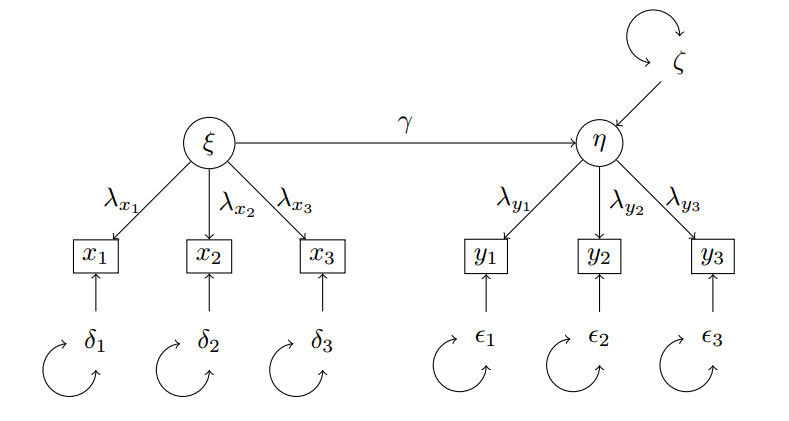
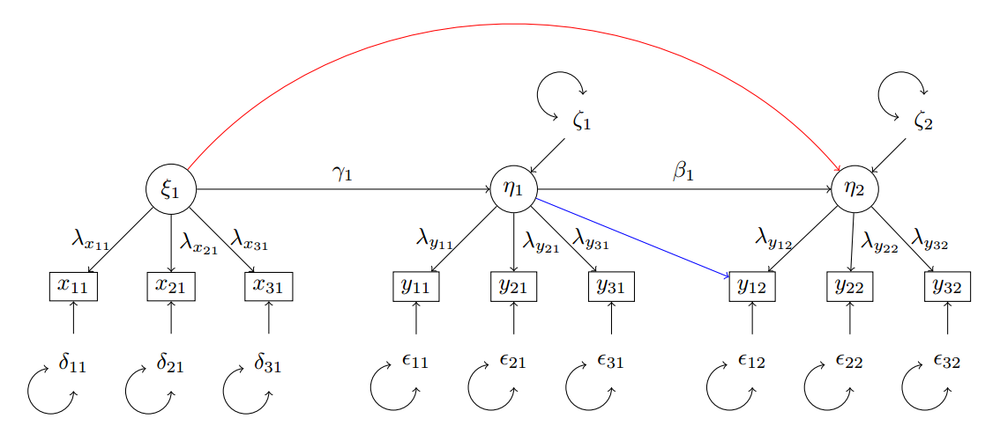
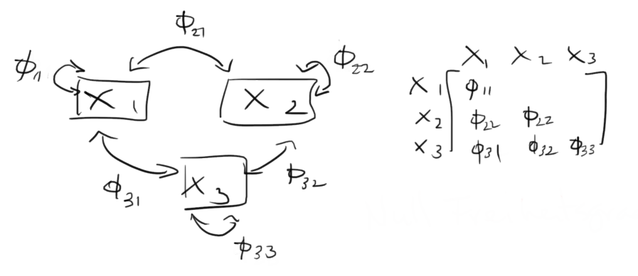
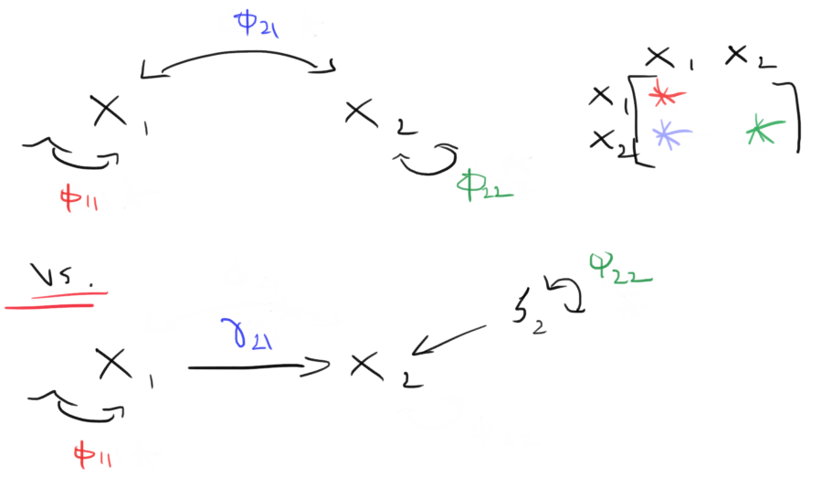
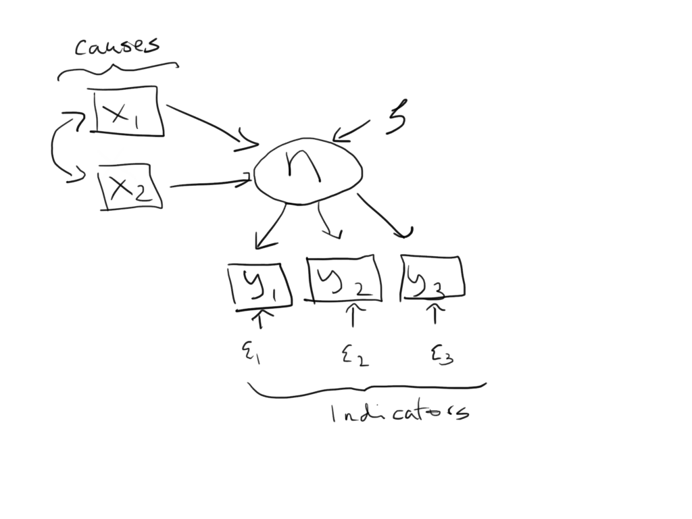
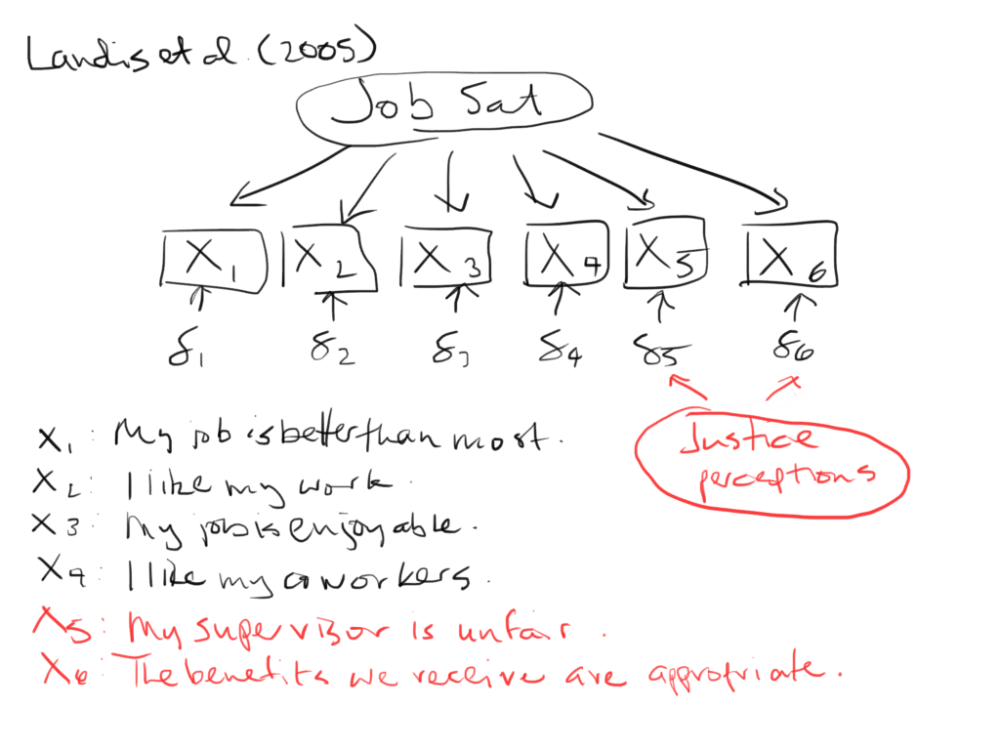

```{r setup, include=FALSE}
knitr::opts_chunk$set(echo = FALSE)
```

```{r script-hooks, echo=FALSE, message=FALSE, warning=FALSE, error=FALSE}
library(knitr)

# Script hook for printing only certain lines
hook_output <- knit_hooks$get("output")
knit_hooks$set(output = function(x, options) {
  lines <- options$output.lines
  if (is.null(lines)) {
    return(hook_output(x, options))  # pass to default hook
  }
  x <- unlist(strsplit(x, "\n"))
  more <- "..."
  if (length(lines)==1) {        # first n lines
    if (length(x) > lines) {
      # truncate the output, but add ....
      x <- c(head(x, lines), more)
    }
  } else {
    x <- c(if (abs(lines[1])>1) more else NULL, 
           x[lines], 
           if (length(x)>lines[abs(length(lines))]) more else NULL
    )
  }
  # paste these lines together
  x <- paste(c(x, ""), collapse = "\n")
  hook_output(x, options)
})

# From: https://community.rstudio.com/t/showing-only-the-first-few-lines-of-the-results-of-a-code-chunk/6963/2
# Retrieved on: 26.05.2020
```

```{r examples, echo=FALSE, message=FALSE, warning=FALSE, error=FALSE}
library(haven)
library(lavaan)

# Set working directory 
setwd("C:/Users/Henrik/github_projects/sem-methodentage-uni-giessen/data")

# Import ALLBUS 2018 
df <- read_sav("allbus2018.sav")

m4 <- '
xeno =~ 1*px06 + px07 + px10 + pa09 + pa19
anom =~ 1*lp03 + lp04 + lp05 + lp06
xeno ~~ anom 
'
m4.fit <- sem(m4,
              estimator = "ML", 
              data = df)
# summary(m4.fit, 
#         fit.measures = TRUE, 
#         # modindices = TRUE,
#         standardized = TRUE)
# modindices(m4.fit, sort = TRUE, minimum.value = 5)
```

# Struktur 

<center>

{width=750px}

{width=750px}
</center>

# Einführung

Das "General SEM" kombiniert Regression, Mediation und CFA 

Wir fokussieren auf die **strukturellen** Beziehungen zwischen v.a. **latenten Variablen**

Der Hauptvorteil ist, dass wir dadurch **Messfehler** im Griff bekommen, die die Koeffizienten eines Regressionsmodells **erheblich verzerren** können

# Messfehler und Attenuationskorrektur 

Wir gehen davon aus, dass Indikatoren sich zusammensetzen aus 

\begin{align}
\text{observed score} & = \text{true score} + \text{error}
\end{align}

wobei das latente Konstrukt der wahre Wert repräsentiert 

Das können wir anders formulieren

\begin{align}
\tilde{x} & = x + \delta \\
\tilde{y} & = y + \epsilon
\end{align}

wobei $\tilde{x}$ und $\tilde{y}$ die beobachteten Werte sind, und $x$ und $y$ die wahren Werte sind und $\delta$ und $\epsilon$ die Messfehler sind

Beachte: die wahren Werte und die Messfehler können komplett unkorreliert sein! 

---

## Messfehler und Attenuationskorrektur

Jetzt schätzen wir eine normale lineare Regression mit den **beobachteten Variablen**, die Messfehlerbelastet sind

\begin{align}
y & = \gamma x + \zeta 
\end{align}

Beachte: Messfehler bei der AV ist **weniger schlimm**

\begin{align}
y & = \gamma x + \zeta \\
(\tilde{y} - \epsilon) & = \gamma x + \zeta \\
\tilde{y} & = \gamma x + (\zeta + \epsilon) 
\end{align}

Solange $\epsilon$ mit $x$ unkorreliert ist (die **Exogenitätsannahme**), ist $\gamma$ weiterhin **unverzerrt**

Aber die Fehlervarianz wird somit erhöht. Dies führt zu erhöhten Standardfehler und geringer $R^{2}$

--- 

## Messfehler und Attenuationskorrektur

Messfehler bei der UV ist **schlimmer**

\begin{align}
y & = \gamma x + \zeta \\
 & = \gamma (\tilde{x} - \delta) + \zeta \\
 & = \gamma \tilde{x} - \gamma \delta + \zeta \\
 & = \gamma \tilde{x} + (\zeta - \gamma \delta)
\end{align}

Hier ist die **Exogeneitätsannahme immer verletzt**: $\tilde{x}$ wird immer mit $\delta$ korreliert sein

\begin{align}
\Cov(\tilde{x}, \delta) & = \Cov(x + \delta, \delta) \\ 
 & = \Cov(x \delta + \delta^{2}) \\
 & = \Var(\delta) 
\end{align}

solange $\Var(\delta) \ne 0$ (dann gäbe es kein Messfehler und $\tilde{x} = x$)

D.h. selbst wenn der Messfehler nichts mit dem wahren Wert zu tun hat wird $\gamma$ verzerrt sein

---

# Ein simuliertes Beispiel 

Hier eine einfache Regression, einmal mit den **Variablen ohne Fehler** 

```{r echo=TRUE}
library(lavaan)

# Seed für die Replizierbarkeit
set.seed(1234)

# Große "Stichprobe", um Sampling Error zu minimieren
n <- 10000

# Populationseffekt, d.h. "wahrer Effekt"
beta <- 0.5

# Unabhängige Variable 
x <- rnorm(n = n, mean = 0, sd = 1)

# Abhängige Variable
y <- beta * x + rnorm(n = n, mean = 0, sd = 1)

# Dataframe erstellen 
df <- data.frame(x, y)

# Einfaches lin. Regressionsmodell in SEM
m1 <- '
y ~ beta*x
x ~~ phi*x
y ~~ psi*y
'
m1.fit <- sem(model = m1, data = df)
```

--- 

## Ein simuliertes Beispiel 

Hier ist Effekt $\beta$ unverzerrt 

```{r echo=TRUE}
summary(m1.fit)
```

---

## Ein simuliertes Beispiel 

Jetzt fügen wir Messfehler zu $x$ hinzu

```{r echo=TRUE}
# Messfehler 
xtilde <- x + rnorm(n = n, mean = 0, sd = 1)

# Füge xtilde zum Dataframe hinzu
df <- data.frame(x, y, xtilde)

# Schätze Modell, diesmal mit xtilde statt x
m2 <- '
y ~ beta*xtilde
xtilde ~~ phi*xtilde
y ~~ psi*y
'
m2.fit <- sem(model = m2, data = df)
```

---

## Ein simuliertes Beispiel 

Nun ist der **Effekt 'nach unten' Verzerrt** 

```{r echo=TRUE}
summary(m2.fit)
```

---

## Ein simuliertes Beispiel 

Warum wird der Effekt immer 'nach unten' (Richtung null) verzerrt sein? Weil 

\begin{align}
\hat{\gamma} & = \frac{\Cov(y, \tilde{x})}{\Var(\tilde{x})} \\
 & = \frac{\Cov(\gamma x + \zeta, x + \delta)}{\Cov((x + \delta)^{2})} \\
 & = \frac{\gamma \Var(x) + \gamma \Cov(x, \delta) + \Cov(x, \zeta) + \Cov(\zeta, \delta)}{\Var(x) + 2\Cov(x, \delta) + \var(\delta)} \\
 & = \gamma \frac{\Var(x)}{\Var(x) + \Var(\delta)}
\end{align}

weil $\Cov(x, \delta) = \Cov(x, \zeta) = \Cov(\zeta, \delta) = 0$, per Annahme.

Zudem $\Var(x) \le \Var(x) + \Var(\delta)$

D.h. wir multiplizieren $\gamma$, der 'wahre Effekt', immer mit einem Wert $\le 1$   

Bspw. wenn $\gamma = 0.5$, $\Var(x) = 1$ und $\Var(\delta) = 1$, dann ist der geschätzte Effekt

\begin{align}
\hat{\gamma} & = 0.5 \frac{1}{1 + 1} \\
 & = 0.5 \frac{1}{2} \\
 & = 0.25 
\end{align}

---

## Ein simuliertes Beispiel

Die AV ist schon 'mit Fehler' gemessen, da wir immer davon ausgehen, dass es andere Faktoren außer der UV, die $y$ beeinflussen

\begin{align}
y & = \gamma + x + \color{red} \zeta 
\end{align}

Je größer die Fehlervarianz, d.h., der nicht erklärte Anteil von $y$, desto geringer wird $R^{2}$ ausfallen, und desto höher werden die Standardfehler 

---

## Ein simuliertes Beispiel 

Fügen wir noch mehr "Fehler" zu $y$ (wir erhöhen den nicht erklärte Varianzanteil): 

```{r echo=TRUE, output.lines=20:23}
df$ytilde <- y + rnorm(n = n, mean = 0, sd = 3)

m3 <- '
ytilde ~ beta*x
x ~~ phi*x
ytilde ~~ psi*ytilde
'
m3.fit <- sem(model = m3, data = df)
```

Hier die **Standardfehler im Vergleich**

```{r output.lines=20:23}
summary(m1.fit)
```

```{r output.lines=20:23}
summary(m3.fit)
```

(Der Standardfehler hat sich verdreifacht, z-Wert verringert sich von 50 auf 16)

Und **$R^{2}$ im Vergleich**

```{r echo=TRUE}
lavInspect(m1.fit, "r2"); lavInspect(m3.fit, "r2")
```

($R^{2}$ reduziert sich von 0.201 auf 0.025)

--- 

# Messfehler entgegenwirken

Messmodell bieten die Möglichkeit an, die beobachtete Variable in 

- valide Varianz (verursacht durch die latente Variable)
- Fehlervarianz (Messfehler, andere Einflussfaktoren)

zu zerlegen

Die latente Variable repräsentiert die gemeinsame Varianz der Indikatoren, d.h., die Indikatoren bereinigt um den Messfehler 

Indem wir die **Regressionen auf latenten Variable-Ebene** spezifizieren, können wir Zerrungen von Messfehlern entgegenwirken

---

# Notation 

Wir nennen exogene latente Variablen $\xi$ und endogene latente Variablen $\eta$

Erinnern wir zurück an die Notation vom Mediationsmodell

\begin{align}
\mathbf{y} & = \boldsymbol{B}\mathbf{y} + \boldsymbol{\Gamma}\mathbf{x} + \boldsymbol{\zeta}
\end{align}

Beim generellen SEM finden die Regressionen zwischen den latenten Variablen statt. Wir haben also das **Strukturmodell**

\begin{align}
\boldsymbol{\eta} & = \boldsymbol{B}\boldsymbol{\eta} + \boldsymbol{\Gamma}\boldsymbol{\xi} + \boldsymbol{\zeta}
\end{align}

wobei die latenten Variablen lassen sich über die **Messmodelle** definieren

\begin{align}
\mathbf{x} & = \boldsymbol{\Lambda}_{x}\boldsymbol{\xi} + \boldsymbol{\delta} \\
\mathbf{y} & = \boldsymbol{\Lambda}_{y}\boldsymbol{\eta} + \boldsymbol{\epsilon}
\end{align}

--- 

## Notation 

Angenommen, wir hätte zwei latenten Variablen, eine exogen, die andere endogen, jeweils mit drei Indikatoren gemessen. 

Wir hätten für die **Messmodelle**

\begin{align}
\boldsymbol{y} & = \boldsymbol{\Lambda}_{y}\boldsymbol{\eta} + \boldsymbol{\epsilon} \\
\begin{bmatrix}
y_{1} \\ y_{2} \\ y_{3} 
\end{bmatrix} & = 
\begin{bmatrix}
\lambda_{y_{1}} \\ \lambda_{y_{2}} \\ \lambda_{y_{3}}
\end{bmatrix}
\eta + 
\begin{bmatrix}
\epsilon_{1} \\ \epsilon_{2} \\ \epsilon_{3}
\end{bmatrix}, \\
\boldsymbol{x} & = \boldsymbol{\Lambda}_{x}\boldsymbol{\xi} + \boldsymbol{\delta} \\
\begin{bmatrix}
x_{1} \\ x_{2} \\ x_{3} 
\end{bmatrix} & = 
\begin{bmatrix}
\lambda_{x_{1}} \\ \lambda_{x_{2}} \\ \lambda_{x_{3}}
\end{bmatrix}
\xi + 
\begin{bmatrix}
\delta_{1} \\ \delta_{2} \\ \delta_{3}
\end{bmatrix}
\end{align}

und für das **Strukturmodell**

\begin{align}
\boldsymbol{\eta} & = \boldsymbol{B}\boldsymbol{\eta} + \boldsymbol{\Gamma}\boldsymbol{\xi} + \boldsymbol{\zeta} \\
\eta & = \gamma \xi + \zeta
\end{align}

---

## Notation 

Als Pfaddiagram 



Wir wissen schon: 

$\Var(\xi) = \phi$, $\Var(\zeta) = \psi$, $\Var(\delta_{j}) = \theta_{\delta_{j}}$, $\Var(\epsilon_{k}) = \theta_{\epsilon_{k}}$

---

# Vorgehen 

Wir kombinieren jetzt Messmodell und Strukturmodell

Messmodelle müssen aber stimmen, d.h., wir müssen die **Validität und Reliabilität des Messmodells testen**, bevor wir das Strukturmodell spezifizieren

Wir gehen meistens in zwei Schritten vor:

1. Eine 'simultane' CFA aller latenten Variablen schätzen und psychometrische Eigenschaften überprüfen
2. Das volle SEM schätzen, nachdem wir mit der CFA zufrieden sind

---

## Vorgehen 

Warum nicht alles auf einmal? 

Wenn das Fit sich als inadäquat herausstellt, wird es schwierig sein festzustellen, ob die Probleme auf Mess- oder Strukturebene sind



--- 

## Vorgehen

Wir schätzen eine CFA mit allen Messmodellen simultan

Das gibt Vorteile gegenüber separate CFAs

Wir lassen **alle latente Konstrukte miteinander korrelieren**: somit ist die Struktur-Ebene **'gesättigt'** (Englisch: 'saturated', d.h. null Freiheitsgrade)

Ein Modell mit null Freiheitsgraden **passt perfekt** ($\chi^{2} = 0$, usw.). Wenn das Modell trotzdem nicht gut passt, dann **muss die Ursache auf Messmodell-Ebene** zu finden sein 



--- 

# Empirisches Beispiel 

Wir möchten das Modell aus Übung 2 nun replizieren

Wir hatten additive Indizes für Fremdenfeindlichkeit und Populismus gebildet und eine Regression in SEM geschätzt 

Nun wollen wir die latente Variablen, Fremdenfeindlichkeit und Populismus, in Messmodellen erfassen

Wir blenden Schicht erstmal aus und betrachten den 'bivariaten' Zusammenhang zw. Populismus und Fremdenfeindlichkeit 

---

## Empirisches Beispiel 

Setup

```{r echo=TRUE}
# Paket haven für SPSS Dateien
library(haven)
library(lavaan)

# Arbeitsverzeichnis 
setwd("C:/Users/Henrik/github_projects/sem-methodentage-uni-giessen/data") # Anpassen!

# Daten importieren  
df <- read_sav("allbus2018.sav")
```

---

## Empirisches Beispiel 

Eine 'simultane' CFA

```{r echo=TRUE}
# Beide latente Variablen sind noch exogen, daher die Notation 
cfa1 <- '
# Messmodelle
  fremdf =~ 1*px06  + l21*px07  + l31*px10
  poplsm =~ 1*pa30r + l22*pa32r + l32*pa35r
# Messfehler
  px06  ~~ thete11*px06
  px07  ~~ theta21*px07
  px10  ~~ theta31*px10
  pa30r ~~ theta12*pa30r
  pa32r ~~ theta22*pa32r
  pa35r ~~ theta32*pa35r
# Varianzen der latenten Variablen
  fremdf ~~ phi11*fremdf
  poplsm ~~ phi22*poplsm
# Kovarianz der latenten Variablen
  fremdf ~~ phi21*poplsm
'
cfa1.fit <- cfa(model = cfa1, data = df, estimator = "ML")
```

Wobei alles was wir brauchen ist eigentlich nur:

```{r echo=TRUE, eval=FALSE}
cfa1 <- '
  fremdf =~ px06 + px07 + px10
  poplsm =~ pa30r + pa32r + pa35r
  fremdf ~~ poplsm
'
```

---

## Empirisches Beispiel 

Die Zusammenfassung der simultanen CFA. **Sind wir zufrieden?**

```{r echo=TRUE}
summary(cfa1.fit, fit.measures = TRUE, standardized = TRUE)
```
--- 

## Empirisches Beispiel

Angenommen, wir sind mit den Messmodellen zufrieden. Nun können wir das SEM schätzen. 

```{r echo=TRUE}
sem1 <- '
# Messmodelle
  fremdf =~ 1*px06  + l21*px07  + l31*px10
  poplsm =~ 1*pa30r + l22*pa32r + l32*pa35r
# Regression 
  fremdf ~ gamma21*poplsm
# Messfehler
  px06  ~~ thete11*px06
  px07  ~~ theta21*px07
  px10  ~~ theta31*px10
  pa30r ~~ theta12*pa30r
  pa32r ~~ theta22*pa32r
  pa35r ~~ theta32*pa35r
# Exogene Varianz 
  poplsm ~~ phi11*poplsm
# Disturbance/Endogene Varianz
  fremdf ~~ psi11*fremdf
'
sem1.fit <- sem(model = sem1, data = df, estimator = "ML")
```

---

## Empirisches Beispiel

Was fällt auf? V.a. in Bezug auf das Fit?

```{r echo=TRUE}
summary(sem1.fit, fit.measures = TRUE, standardized = TRUE)
```

---

## Empirisches Beispiel 

Die Modelle sind hier Äquivalent!



Das ist aber **nicht immer der Fall!** Ob wir zwei latenten Variablen mit einer Kovarianz oder einem Koeffizient verbinden ist egal. Die Struktur-Ebene ist gesättigt; der Fit ist identisch. 

---

## Empirisches Beispiel 

Lasst uns das generelle SEM mit dem mit additiven Index-Variablen vergleichen (aus Sitzung 1)

Hier das SEM mit latenten Variablen

```{r output.lines=33:36}
summary(sem1.fit, standardized = TRUE)
```

Zum Vergleich: das analoge Modell mit additiven Indizes

```{r echo=FALSE, output.lines=21:24}
# Regressionsmodell 
rm1 <- '
# Regressionen
  fremdfobs ~ gamma21*poplsmobs
# Fehler Varianz
  fremdfobs ~~ theta22*fremdfobs
'
rm1.fit <- sem(model = rm1, data = df, estimator = "ML")
summary(rm1.fit, standardized = TRUE)
```

Der standardisierte Effekt mit latenten Variablen ist 1,4 Mal so groß 

---

# MIMIC Modell

Das generelle SEM ist sehr flexibel 

Wir können beobachtete Variablen auch mit einbeziehen, wie z.B. soziale Schicht

Modelle bei den eine latente Variable durch eine manifeste Variable vorhergesagt wird nennen sich **Multiple Indicators Multiple Causes** (MIMIC)



---

## MIMIC Modell

Wir können **Schicht** in das SEM wieder aufnehmen, um ein Beispiel eines MIMIC Modells anzuschauen

Das wird das **Mediationsmodell** von Sitzung 2 sein, nur diesmal mit latenten Variablen für Populismus und Fremdenfeindlichkeit

Wir nehmen an, dass Schicht **ohne Fehler** gemessen wurde 

Die Implementation ist sehr einfach: 

```{r echo=TRUE}
sem2 <- '
# Messmodelle
  fremdf =~ 1*px06  + l21*px07  + l31*px10
  poplsm =~ 1*pa30r + l22*pa32r + l32*pa35r
# Regression 
  fremdf ~ gamma11*id02 + beta12*poplsm
  poplsm ~ gamma21*id02
# Messfehler
  px06  ~~ thete11*px06
  px07  ~~ theta21*px07
  px10  ~~ theta31*px10
  pa30r ~~ theta12*pa30r
  pa32r ~~ theta22*pa32r
  pa35r ~~ theta32*pa35r
# Disturbance/Endogene Varianzen
  fremdf ~~ psi11*fremdf
  poplsm ~~ phi11*poplsm
'
sem2.fit <- sem(model = sem2, data = df, estimator = "ML")
```

---

## MIMIC Modell

```{r echo=TRUE}
summary(sem2.fit, fit.measures = TRUE, standardized = TRUE)
```

---

# Modifikationsindizes 

Das Fit bei `sem2.fit` war teils widersprüchlich

- Chi Square signifikant
- CFI und SRMR gut
- TLI und RMSEA nicht so gut

Was tun? 

Am besten: **zurück zur Theorie** 

- Indikatoren geeignet? Z.B. Think-Aloud Methode um Messmodelle zu optimieren (Kreuzladungen ausschließen, Wording, Reihenfolge Effekte beachten, usw.)
- Strukturebene richtig spezifiziert? Sind alle Confounder kontrolliert? Direkte Effekte möglich? 

---

## Modifikationsindizes

Manchmal ist schwer zu erkennen **wo genau die Probleme liegen**

Eine andere Möglichkeit bieten die **Modifikationsindizes** (MI) an

D.h. wir lassen die Daten sprechen: 

- wo gibt es Fehlerkorrelationen? (Hinweise auf weitere nicht-beachteten latenten Variablen)
- wo gibt es Kreuzladungen? (Hinweis auf Messmodellprobleme)
- sind alle Strukturpfade berücksichtigt? (Hinweise auf Misspezifikation)

---

## Modifikationsindizes

Die MIs geben ungefähre Auskunft darüber, **um wie viel besser das Modellfit wäre, wenn das Modell um weitere Parameter erweitert wäre**

D.h., für jede Parameter, der auf null gesetzt ist, geben die MIs die ungefähre Verbesserung wenn der stattdesser freigeschätzt wäre

Wenn das Modellfit suboptimal ist, können die MIs Hinweise geben, wo die Probleme liegen

--- 

## Modifikationsindizes

Ein Beispiel aus @Landis2009



---

## Modifikationsindizes

**Neue Parameter** aufnehmen: 

- auch "Lagrange Multiplier" oder "Test Scores" genannt
- um wie viel besser passt das Modell wenn Parameter, die auf null gesetzt sind, freigeschätzt werden

**Redundante Parameter** streichen:

- auch "Wald Statistiken" genannt
- manche Fitmaße (z.B. CFI) berücksichtigen Sparsamkeit, d.h. Ratio von Chi Square zu Freiheitsgraden
- gibt es Parameter, die kaum zum Fit beitragen, die auf null gesetzt werden können? 

---

## Modifikationsindizes

Vorschläge für neue Parameter mit `modindices()`

```{r echo=TRUE}
modindices(sem2.fit, sort = TRUE)
```

---

## Modifikationsindizes

Nur die 'wichtigsten':

```{r echo=TRUE}
modindices(sem2.fit, sort = TRUE, minimum.value = 15)
```

- `lhs op rhs`: um welchen Parameter es handelt
- `mi`: ungefähre Verbesserung in Chi Square Einheiten
- `epc`: 'expected parameter change', ungefährer Wert des Parameters
- `sepc.all`: `epc` wenn beide Variablen standardisiert sind 

Bspw. bei `poplsm =~ px06`: Chi Square würde sich um ca. 45.149 verbessern wenn die Kreuzladung geschätzt wäre (standardisierte Faktorladung von ca. 0.316)

---

## Modifikationsindizes

Wir können Tests durchführen, dass einzelne Parameter eigentlich null sind mit `lavTestWald()`

D.h., um wie viel verschlechtert sich das Fit wenn wir einen Parameter auf null setzen? 

Bspw. Test des direkten Effekts Populismus $\rightarrow$ Fremdenfeindlichkeit ist eigentlich 0 

```{r echo=TRUE}
lavTestWald(sem2.fit, constraints = "gamma11 == 0")
```

- `$stat`: voraussichtliche Verschlechterung des Fits
- `p.value`: signifikante Verschlechterung? 

# Aussicht

xxx

# Backup 


## Annahmen

Die Modellannahmen sind die selben, die wir bisher besprochen hatten

- Variablen sind mittelwert zentriert
- Linearität 
- keine perfekte Multikollinearität
- keine Autokorrelation, bezogen auf 
  + $\E(\delta_{j_{i}}\delta_{js}) = 0, \ i \ne s$ 
  + $\E(\epsilon_{k_{i}}\epsilon_{k_{s}}) = 0, \ i \ne s$ 
  + $\E(\zeta_{i}\zeta_{s}) = 0, \ i \ne s$
- Homoskedastizität, bezogen auf 
  + $\Var(\delta | \xi) = \Var(\delta)$
  + $\Var(\epsilon | \eta) = \Var(\epsilon)$ 
  + $\Var(\zeta | \xi) = \Var(\zeta)$
- Normalverteilung, bezogen auf
  + $\delta \sim N(0, \theta_{\delta})$
  + $\epsilon \sim N(0, \theta_{\epsilon})$
  + $\zeta \sim N(0, \psi)$
- Exogenität, bezogen auf
  + $\E(\delta | \xi) = E(\delta) = 0$, $\Cov(\delta_{j},\delta_{k}) = 0, \ j \ne k$
  + $\E(\epsilon | \eta) = \E(\epsilon) = 0$
  + $\E(\zeta | \xi) = \E(\zeta) = 0$


# Referenzen 

